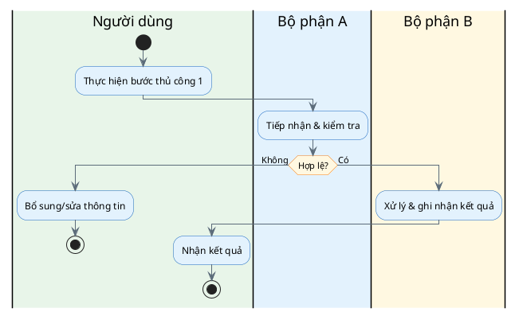

# Mô tả Quy trình Hiện trạng (As-is)

| Trường | Nội dung |
|---|---|
| Quy trình | |
| Phạm vi | |
| Nguồn thông tin | (phỏng vấn/quan sát/tài liệu) |

## Tổng quan
*Mục đích quy trình, người liên quan, kích hoạt khi nào.*

## Các bước hiện tại
| # | Bước | Actor | Đầu vào | Đầu ra | Công cụ/Hệ thống | Pain point |
|---|---|---|---|---|---|---|
| 1 | | | | | | |
| 2 | | | | | | |

## Quy tắc nghiệp vụ hiện hành
-

## Điểm đau & cơ hội cải tiến
| Pain point | Tác động | Cơ hội cải tiến (to-be sẽ xử lý) |
|---|---|---|
| | | |

## Sơ đồ (PlantUML — swimlane theo vai trò)
*Xem `references/diagrams.md`. Mỗi `|#Màu|Tên lane|` là một vai trò/phòng ban; thay nội dung mẫu
bằng quy trình thực tế.*

