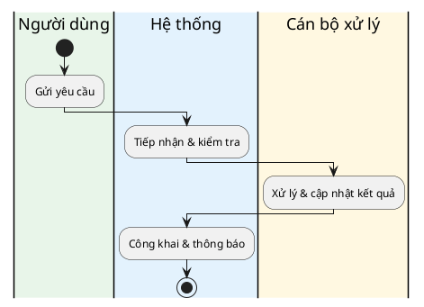

# Business Requirements Document (BRD) — Tài liệu Yêu cầu Nghiệp vụ

> Hướng dẫn & tiêu chuẩn (gồm "Tiêu chuẩn nâng cao"): xem `references/brd-guide.md`.
> Sơ đồ quy trình: **swimlane PlantUML** (nhiều actor) hoặc **flowchart Mermaid** (đơn giản) — `references/diagrams.md`.
> Nguyên tắc truy vết: mỗi chức năng có **Mã CN** ở Scope → tham chiếu lại trong FR và Use Case.

**Dự án:** [TÊN DỰ ÁN]  ·  **Ngày:** DD/MM/YYYY  ·  **Phiên bản:** vX.Y  ·  **Đơn vị/Công ty:** ____

---

## 1. Lịch sử thay đổi (Document Revisions)

| Ngày | Phiên bản | Nội dung thay đổi | Người thực hiện |
|---|---|---|---|
| | v0.1 | Bản nháp đầu tiên | |

## 2. Phê duyệt (Approvals)

| Vai trò | Họ tên | Chức danh | Chữ ký | Ngày |
|---|---|---|---|---|
| Nhà tài trợ dự án (Sponsor) | | | | |
| Quản lý nghiệp vụ (Business Owner) | | | | |
| Quản lý dự án (PM) | | | | |
| Kiến trúc sư hệ thống | | | | |
| Trưởng nhóm phát triển | | | | |
| Trưởng nhóm UX | | | | |
| Trưởng nhóm QA | | | | |

---

# 3. Giới thiệu (Introduction)

## 3.1 Tổng quan dự án

### 3.1.1 Mục tiêu (Objectives — SMART)
*Mục tiêu tổng thể, sản phẩm làm gì ở mức cao, gắn mục tiêu kinh doanh, tương tác hệ thống khác.*
-

### 3.1.2 Bối cảnh (Background)
*Vấn đề/khó khăn đã xác định + lợi ích kỳ vọng.*
-

#### Business Drivers (Yếu tố thúc đẩy)
-

#### Căn cứ pháp lý *(nếu là dự án thuộc lĩnh vực được điều chỉnh — chính phủ, tài chính, y tế...)*
| STT | Căn cứ pháp lý | Nội dung liên quan trực tiếp đến hệ thống (module nào) | Link |
|---|---|---|---|
| 1 | <Luật/Nghị định/Thông tư> | | |

## 3.2 Phạm vi dự án (Project Scope)

### 3.2.1 Danh sách chức năng trong phạm vi (In-Scope)
*Gom theo nhóm chức năng; mỗi chức năng có Mã CN duy nhất (dùng để truy vết ở FR & Use Case).*

| STT | Mã CN | Tên chức năng | Mô tả | Đối tượng | Ghi chú (tích hợp/ràng buộc) |
|---|:---:|---|---|---|---|
| **Nhóm 1: <Tên nhóm>** | | | | | |
| 1 | XX-01 | | | | |
| 2 | XX-02 | | | | |
| **Nhóm 2: <Tên nhóm>** | | | | | |
| 1 | YY-01 | | | | |

### 3.2.2 Ngoài phạm vi (Out-of-Scope)
*Nêu rõ những gì hệ thống KHÔNG làm lần này.*
-

## 3.3 Góc nhìn hệ thống (System Perspective)

### Assumptions (Giả định)
-
### Constraints (Ràng buộc)
-
### Risks (Rủi ro)
-
### Issues (Vấn đề đang tồn tại)
-

## 3.4 Đối tượng sử dụng & vai trò (Actors)
| STT | Tên tác nhân | Vai trò / trách nhiệm |
|---|---|---|
| 1 | Khách truy cập (không đăng nhập) | - Xem thông tin công khai · tra cứu cơ bản |
| 2 | Cá nhân (có tài khoản) | - ... |
| 3 | Tổ chức / Doanh nghiệp | - ... |
| 4 | Cán bộ chuyên môn | - ... |

---

# 4. Tổng quan quy trình nghiệp vụ (Business Process Overview)

*Sơ đồ: swimlane PlantUML khi nhiều actor (xem `references/diagrams.md`). Kèm bảng mô tả từng bước,
đánh dấu cột **Phạm vi** = Trong phạm vi (hệ thống này làm) / Ngoài phạm vi (thủ công/hệ thống khác).*

## 4.1 Quy trình hiện tại (As-Is)
*(mô tả + sơ đồ)*

## 4.2 Quy trình đề xuất (To-Be)

**Bảng mô tả các bước:**

| Mã bước | Tên bước | Thực hiện (ai) | Diễn giải | Phạm vi |
|---|---|---|---|---|
| BĐ | Bắt đầu | | | |
| B1 | | | | Trong phạm vi |
| B2 | | | | Ngoài phạm vi |
| KT | Kết thúc | | | |

---

# 5. Yêu cầu nghiệp vụ (Business Requirements)

**Thang ưu tiên:**

| Value | Rating | Mô tả |
|---|---|---|
| 1 | Critical | Cực kỳ quan trọng; dự án không khả thi nếu thiếu |
| 2 | High | Ưu tiên cao; vẫn triển khai mức tối thiểu được nếu thiếu |
| 3 | Medium | Mang lại giá trị nhất định; dự án vẫn tiếp tục được |
| 4 | Low | Ưu tiên thấp / "nên có" nếu thời gian & chi phí cho phép |
| 5 | Future | Ngoài phạm vi lần này; xem xét cho bản phát hành tương lai |

## 5.1 Yêu cầu chức năng (Functional Requirements)
*Mô tả theo các bước, gài quy tắc nghiệp vụ đo được. Cột **Mã CN** liên kết về Danh sách chức năng (3.2.1).*

| Mã yêu cầu | Ưu tiên | Người dùng chính | Mô tả yêu cầu (các bước + quy tắc) | Lý do (Rationale) | Mã CN | Stakeholder ảnh hưởng |
|---|:---:|---|---|---|---|---|
| **Nhóm: <Tên nhóm>** | | | | | | |
| FR-001 | 1 | | | | XX-01 | |
| FR-002 | 2 | | | | XX-02 | |

## 5.2 Yêu cầu phi chức năng (Non-Functional Requirements)
*Gom theo nhóm; mỗi NFR có ngưỡng đo; viện dẫn tiêu chuẩn/nghị định khi áp dụng.*

| ID | Nhóm | Yêu cầu (có ngưỡng đo / tham chiếu tuân thủ) |
|---|---|---|
| NFR-001 | Hiệu năng | API tra cứu < 2 giây với 95% request |
| NFR-002 | Hiệu năng | Tải trang < 3 giây trên mạng 4G |
| NFR-003 | Khả dụng | Uptime ≥ 99.5%/năm |
| NFR-004 | Khả mở rộng | Bổ sung module không ảnh hưởng module khác |
| NFR-005 | Bảo mật | <vd: an toàn thông tin cấp độ 3 theo NĐ 85/2016> |

## 5.3 Danh sách Use Case tổng hợp *(tuỳ chọn — bàn giao sang Pha 3)*
| # | Tên Use Case | Tác nhân chính | Mô tả các bước | Mã CN |
|---|---|---|---|---|
| **I. <Nhóm>** | | | | |
| 1 | | | 1. ... 2. ... | XX-01 |

---

# 6. Phụ lục (Appendices)

## 6.1 Thuật ngữ (Glossary)
| STT | Thuật ngữ | Giải thích | Nguồn tham chiếu |
|---|---|---|---|
| 1 | | | |

## 6.2 Tài liệu liên quan (Related Documents)
-
