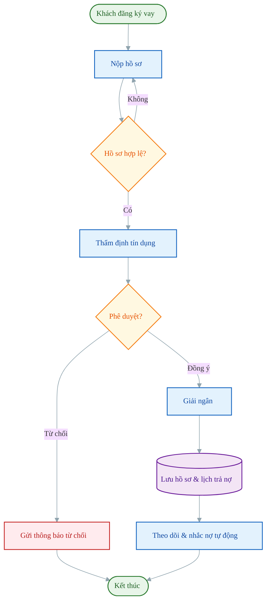
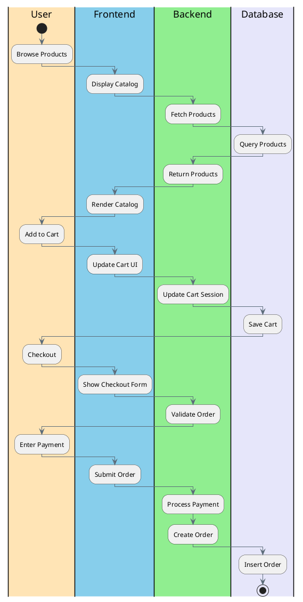
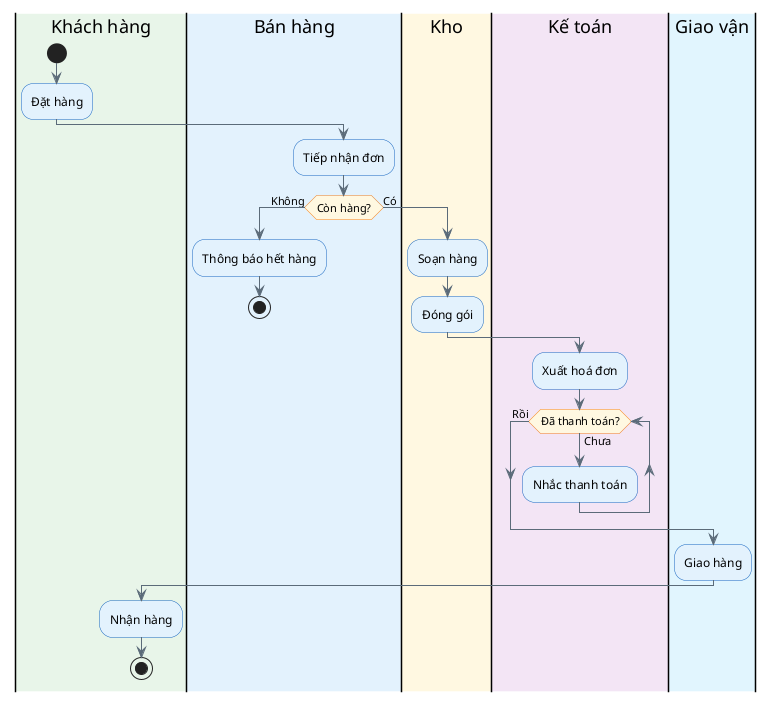
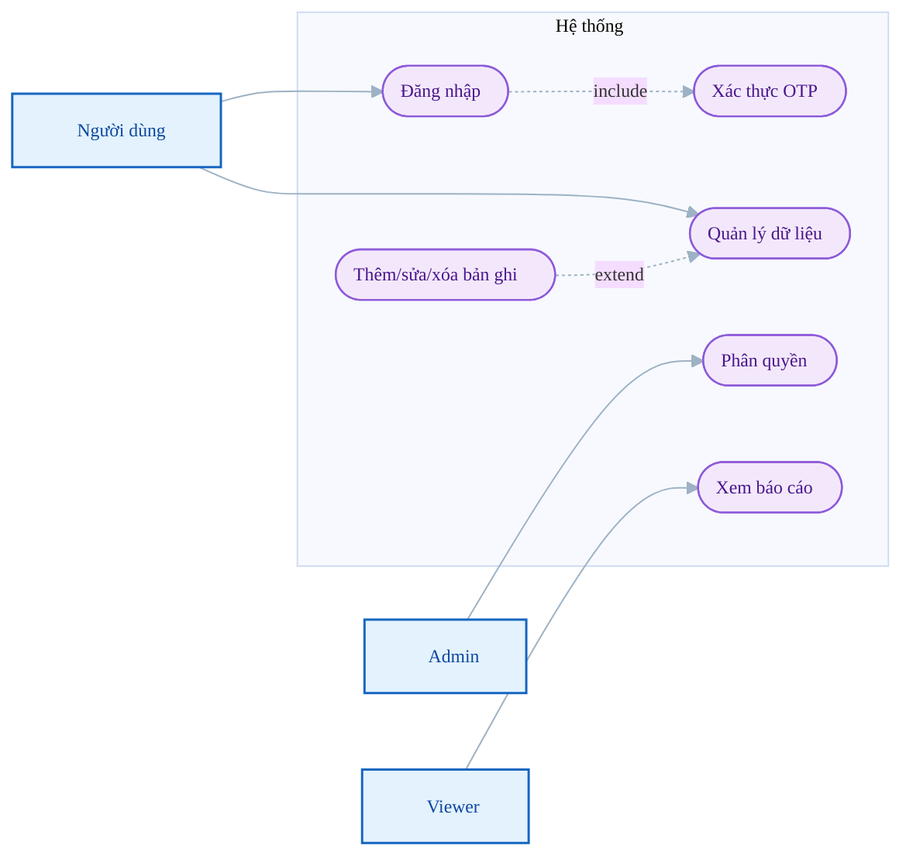
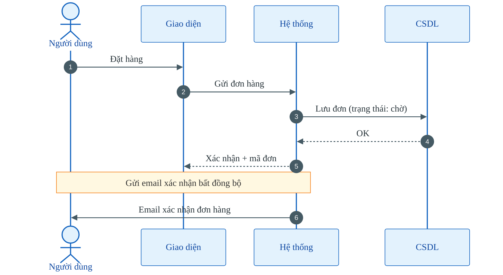
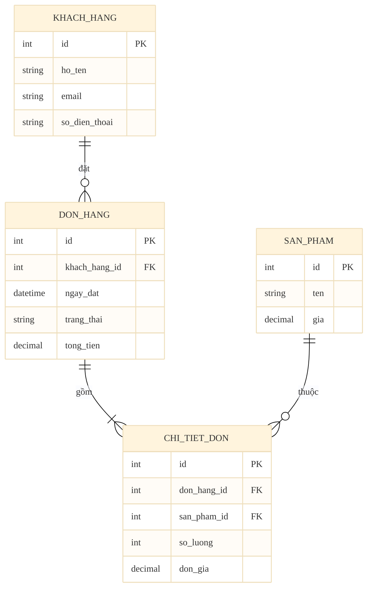
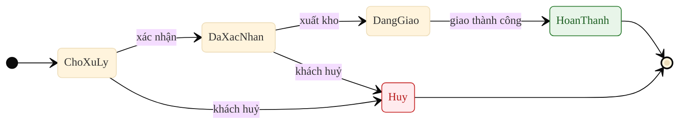
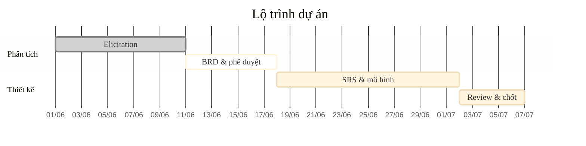

# Sơ đồ cho BA (Mermaid + PlantUML)

Vẽ sơ đồ bằng mã text, nhúng trực tiếp vào markdown (.md), thay cho ảnh tĩnh để dễ chỉnh sửa và
truy vết thay đổi. Quy ước trong tài liệu này:
- **Mermaid** cho flowchart, sequence, ERD, state, gantt — render sẵn trên GitHub/VS Code/Obsidian.
- **PlantUML** cho **swimlane** (Mermaid không có swimlane gốc); Use Case vẽ bằng **Mermaid mô phỏng** — render bằng plugin VS Code/IntelliJ,
  hoặc server plantuml.com / kroki.io.

## Bảng màu chuẩn cho sơ đồ Mermaid
Trong Mermaid, khai báo `classDef` rồi gán bằng `:::tên`. Giữ đúng ý nghĩa màu để dễ nhận diện
(swimlane PlantUML đổi màu lane bằng `|#Màu|Tên|`):

| Vai trò | Ý nghĩa | Màu nền / viền |
|---|---|---|
| `startEnd` | Điểm bắt đầu / kết thúc | xanh lá `#E8F5E9` / `#2E7D32` |
| `process` | Hành động / xử lý | xanh dương `#E3F2FD` / `#1565C0` |
| `decision` | Điểm quyết định | hổ phách `#FFF8E1` / `#F57F17` |
| `data` | Lưu trữ / CSDL | tím `#F3E5F5` / `#6A1B9A` |
| `error` | Lỗi / từ chối | đỏ `#FFEBEE` / `#C62828` |

---

## 1. Flowchart quy trình (As-Is / To-Be)
Dùng cho Business Process Overview. `flowchart TD` (trên→dưới) hoặc `LR` (trái→phải).



Quy ước hình: `([...])` bắt đầu/kết thúc · `[...]` hành động · `{...}` quyết định ·
`[(...)]` cơ sở dữ liệu. Mỗi nhánh quyết định gắn nhãn điều kiện.

---

## 2. Swimlane — dùng PlantUML
**Mermaid không có swimlane gốc** (phải ghép `subgraph` chắp vá, hay vỡ bố cục: lệch chiều cao lane,
mũi tên cắt nhau, `direction` bị bỏ qua). Vì vậy **mọi swimlane dùng PlantUML** — có swimlane dọc gốc
qua cú pháp `|Lane|` trong activity diagram, lane tự căn cột đều, hỗ trợ `if/else`, `while` (vòng lặp),
`fork` (song song). Đặt mã trong khối ```` ```plantuml ... ``` ````. Đổi màu lane bằng `|#Màu|Tên|`.

### Swimlane phân lớp (theo lớp hệ thống)
Luồng mua hàng qua 4 lớp User → Frontend → Backend → Database; mỗi lớp là một lane (cột dọc).



Quy ước: mỗi `|#Màu|Tên lane|` mở một lane (cột dọc); đổi sang lane khác = bàn giao. `:Hành động;`
là một bước; bước viết liên tiếp trong cùng lane sẽ nối dọc xuống. Có thể quay lại lane trước (vd
`Backend → Database → Backend`) để mô tả request/response.

### Quy trình nghiệp vụ end-to-end (có rẽ nhánh & vòng lặp)
Quy trình thực tế nhiều bàn giao, rẽ nhánh, vòng lặp — PlantUML xử lý gọn bằng `if/else`, `while`.



Quy ước PlantUML: `|#Màu|Tên lane|` mở lane (cột dọc, đổi lane = bàn giao) · `start`/`stop` điểm đầu/cuối ·
`:Hành động;` bước xử lý · `if (...) then (...) else (...) endif` rẽ nhánh · `while (...) is (...) endwhile (...)`
vòng lặp · `fork`/`fork again`/`end fork` luồng song song.

> Render PlantUML bằng: plugin VS Code "PlantUML", IntelliJ, hoặc server plantuml.com / kroki.io.
> Các sơ đồ khác trong file (flowchart, sequence, ERD, state, gantt) vẫn dùng Mermaid.

---

## 2b. Use Case Diagram — dùng Mermaid (mô phỏng)
Mermaid không có use case gốc → mô phỏng bằng `flowchart`: **actor** = rectangle có 👤, **use case** =
stadium `(["..."])`, quan hệ `include`/`extend` = cạnh nét đứt có nhãn `-.->|include|` / `-.->|extend|`.
Gói các use case trong `subgraph` làm ranh giới hệ thống.



---

## 3. Sequence diagram (luồng tương tác hệ thống)
Hữu ích cho use case có nhiều thành phần/tích hợp. `autonumber` đánh số bước tự động.



---

## 4. ERD (mô hình dữ liệu)
Dùng cho yêu cầu dữ liệu / từ điển dữ liệu. Khai báo khoá (PK/FK) và bản số quan hệ.



Bản số: `||--o{` một-tới-nhiều · `||--||` một-một · `}o--o{` nhiều-nhiều ·
`||--|{` một-tới-một-hoặc-nhiều.

---

## 5. State diagram (vòng đời trạng thái)
Cho đối tượng có nhiều trạng thái (đơn hàng, hồ sơ...).



---

## 6. Gantt (lộ trình dự án) — tuỳ chọn



---

## Nguyên tắc dùng
- Cây nhiều nhánh (BFD / site map / phân rã chức năng): dùng **`flowchart LR`** (không phải TB/TD) để node con xếp dọc, tránh tràn ngang; nhãn dài nên rút gọn hoặc xuống dòng bằng `<br/>`.
- Giữ đúng bảng màu chuẩn ở mọi sơ đồ để người đọc nhận diện nhanh loại nút.
- Mỗi `classDef`/`init` chỉ cần khai báo một lần trong mỗi khối ```mermaid```.
- Sơ đồ là công cụ giao tiếp — ưu tiên rõ ràng, đồng bộ với mô tả text. Sửa quy trình thì
  cập nhật cả mã Mermaid lẫn bảng mô tả.
- Với BRD: tối thiểu có flowchart As-Is và To-Be.
