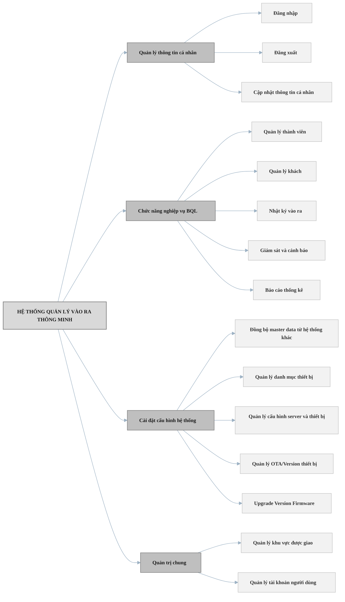
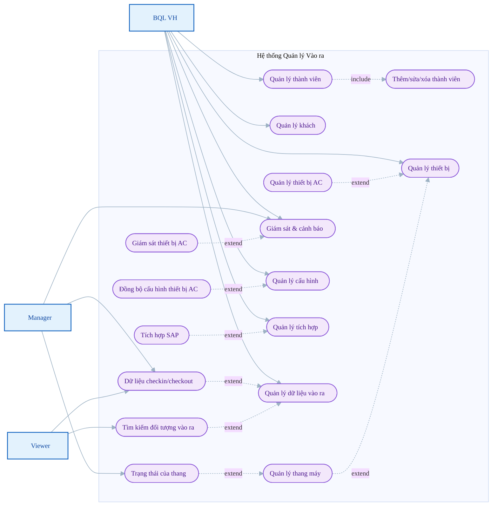
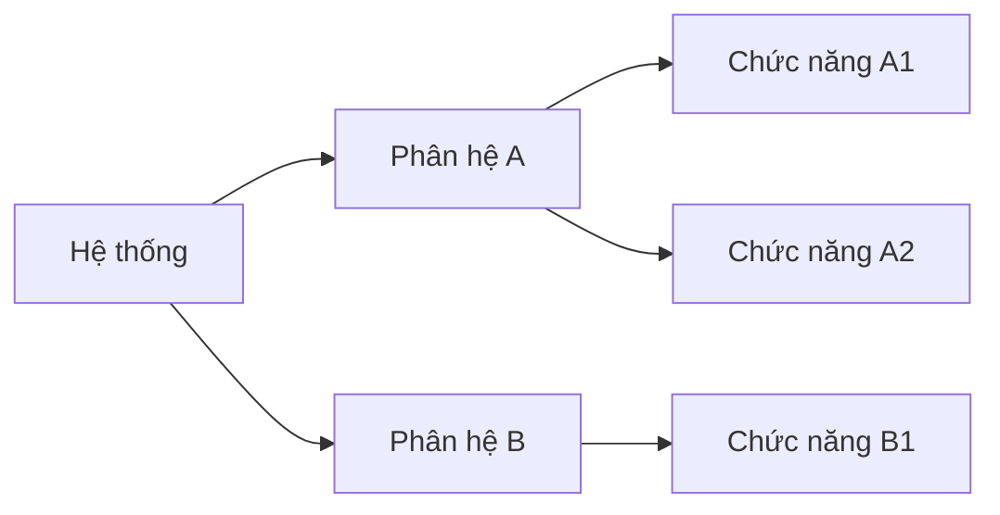
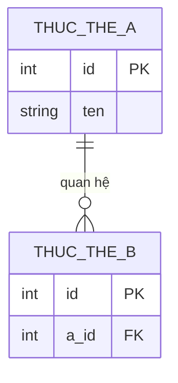
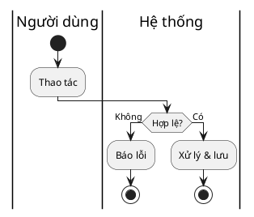

# TÀI LIỆU ĐẶC TẢ YÊU CẦU PHẦN MỀM (SRS)

> Hướng dẫn cách viết từng phần: xem `references/srs-guide.md`.
> Sơ đồ: Use Case (Mermaid mô phỏng), Site map (BFD) & ERD → Mermaid; Luồng xử lý từng chức năng → PlantUML swimlane (xem `references/diagrams.md`).

**DỰ ÁN: [TÊN DỰ ÁN]**

| Mã hiệu dự án | <Mã hiệu dự án> |
|---|---|
| Phiên bản | <x.y> |
| Mã hiệu tài liệu | <Mã hiệu dự án> - SRS - <Phiên bản> |
| Địa điểm, thời gian | <Hà Nội, MM/YYYY> |

## LỊCH SỬ THAY ĐỔI
| Ngày hiệu lực | Phiên bản | Vị trí thay đổi | Nội dung thay đổi | Lý do | Người thay đổi | Người phê duyệt |
|---|---|---|---|---|---|---|
| | | | | | | |

## TRANG KÝ
| Vai trò | Họ và tên - Chức vụ | Chữ ký | Ngày |
|---|---|---|---|
| Người lập | | | |
| Người kiểm tra | | | |
| Người hỗ trợ (khách hàng) | | | |
| Người duyệt | | | |

---

# I. GIỚI THIỆU

## 1. Mục đích
*Tài liệu này dùng để làm gì, phục vụ ai.*

## 2. Phạm vi
*Tên sản phẩm, lợi ích chính, mục tiêu phần mềm hướng tới.*

## 3. Đối tượng sử dụng
*Người thiết kế, lập trình, kiểm thử, vận hành, quản trị...*

## 4. Tài liệu liên quan
| STT | Tài liệu | Phiên bản | Mô tả |
|---|---|---|---|
| 1 | | | |

## 5. Định nghĩa và các từ viết tắt
### 5.1 Định nghĩa
### 5.2 Thuật ngữ / Từ viết tắt
| STT | Thuật ngữ | Định nghĩa |
|---|---|---|
| 1 | | |

---

# II. MÔ TẢ TỔNG THỂ

**Tổng quan phần mềm:**
- **Góc nhìn sản phẩm:** độc lập hay là một phần của hệ thống lớn hơn?
- **Chức năng sản phẩm:** tóm tắt các nhóm chức năng chính.
- **Đặc điểm người dùng:** các nhóm đối tượng (Admin, End-user) và trình độ kỹ thuật.
- **Giả định & phụ thuộc:** yếu tố bên ngoài ảnh hưởng dự án (API bên thứ ba, thư viện...).

## 1. Mô hình tổng quan
*Sơ đồ kiến trúc/khái niệm hệ thống.*
- **1.1 Mô tả các đối tượng/thành phần của hệ thống:**
- **1.2 Mô tả các hệ thống khác liên quan:**

## 2. Luồng nghiệp vụ tổng quan

### 2.1 Sơ đồ nghiệp vụ tổng quan hệ thống
*Sơ đồ phân rã chức năng theo nhóm (cây) — Mermaid `flowchart LR` (trái→phải để node con xếp dọc,
tránh tràn ngang khi nhiều chức năng). Root = hệ thống; cấp 1 = nhóm; cấp 2 = chức năng.*

### 2.2 Use Case Diagram tổng quan
*Mermaid mô phỏng use case (xem `references/diagrams.md`): actor (rectangle) ↔ use case (stadium),
quan hệ `include`/`extend` bằng cạnh nét đứt có nhãn. Mẫu rút gọn — mở rộng theo hệ thống thực tế.*

**Danh sách chức năng – Use Case** (liệt kê & mô tả thêm):

| STT | Tính năng | Mô tả | Chi tiết |
|---|---|---|---|
| 1 | <Nhóm chức năng A> | | Thêm/Tìm/Xem/Sửa/Xoá ... |
| 2 | <Nhóm chức năng B> | | ... |

## 3. Ma trận phân quyền
| STT | Name (Vai trò) | Description (Quyền) | Assigned User | Đối tượng |
|---|---|---|---|---|
| 1 | Administrator | Đầy đủ quyền | | |
| 2 | Operator | Thêm/sửa/xoá theo nhóm | | |
| 3 | Manager | Giám sát, xem | | |
| 4 | Viewer | Chỉ xem | | |

## 4. Sơ đồ chức năng (Site map / BFD)
*Phân rã **chi tiết hơn** mục 2.1 — đi sâu nhiều cấp con cho từng phân hệ (nếu cần). Cùng dạng cây Mermaid.*

## 5. Mô hình dữ liệu (ERD)
*Vẽ bằng Mermaid `erDiagram` (xem `references/diagrams.md`). Kèm từ điển dữ liệu nếu cần.*

| Thực thể | Thuộc tính | Kiểu | Bắt buộc | Quy tắc hợp lệ |
|---|---|---|---|---|
| | | | | |

---

# III. ĐẶC TẢ YÊU CẦU HỆ THỐNG

## 1. Yêu cầu chức năng phần mềm

### 1.1 <Tên chức năng 1>

#### 1.1.1 Mô tả chung
| Trường | Nội dung |
|---|---|
| ID | <ID use case, vd UC-01> |
| Tên | <Tên chức năng> |
| Mô tả | |
| Tác nhân | |
| Ưu tiên | Cao / Trung bình / Thấp |
| Trigger | <Thao tác kích hoạt> |
| Tiền điều kiện | |
| Kết quả (hậu điều kiện) | |
| **Luồng chính** | 1. ... 2. ... 3. ... |
| **Luồng phụ** | |
| **Luồng ngoại lệ / kết thúc** | *(vd: 8b. Nếu file > 1000MB → báo lỗi "...")* |

#### 1.1.2 Luồng xử lý
*Sơ đồ hoạt động dạng swimlane (PlantUML — actor ↔ hệ thống; xem `references/diagrams.md`).*

#### 1.1.3 Quy tắc xử lý nghiệp vụ
| Bước | Người thực hiện / HT | BR Code | Mô tả |
|:---:|:---:|:---:|---|
| 1 | User | BR-01 | |
| 2 | Hệ thống | BR-02 | |

#### 1.1.4 Thiết kế giao diện
*Đính kèm ảnh/wireframe màn hình. Danh sách trường thông tin:*

| STT | Trường thông tin | Định dạng dữ liệu | Mô tả | Bắt buộc |
|---|---|---|---|---|
| 1 | | Text/Number/Date... | | x |

### 1.2 <Tên chức năng 2>
*(lặp lại cấu trúc 1.x.1 → 1.x.4)*

## 2. Yêu cầu phi chức năng phần mềm
| Mục | Yêu cầu | Tiêu chí đo |
|---|---|---|
| 2.1 Hiệu năng | | < 2s với 95% request, N user đồng thời |
| 2.2 Bảo mật | | |
| 2.3 Sao lưu | | tần suất / RPO / RTO |
| 2.4 Tính ổn định | | uptime ≥ 99.5% |
| 2.5 Tính sử dụng | | |

## 3. Các yêu cầu khác
- **3.1 Quy định chung các thành phần hệ thống:**
- **3.2 Quy định về thông báo:**
- **3.3 Quy định tìm kiếm thông tin:**

## 4. Yêu cầu tích hợp
| Hệ thống ngoài | Dữ liệu trao đổi | Giao thức / API | Ghi chú |
|---|---|---|---|
| | | | |

## 5. Chuyển đổi dữ liệu
*Di trú/đồng bộ dữ liệu từ hệ thống cũ (nếu có).*

## 6. Phụ lục
*Tài liệu/biểu mẫu tham chiếu.*
