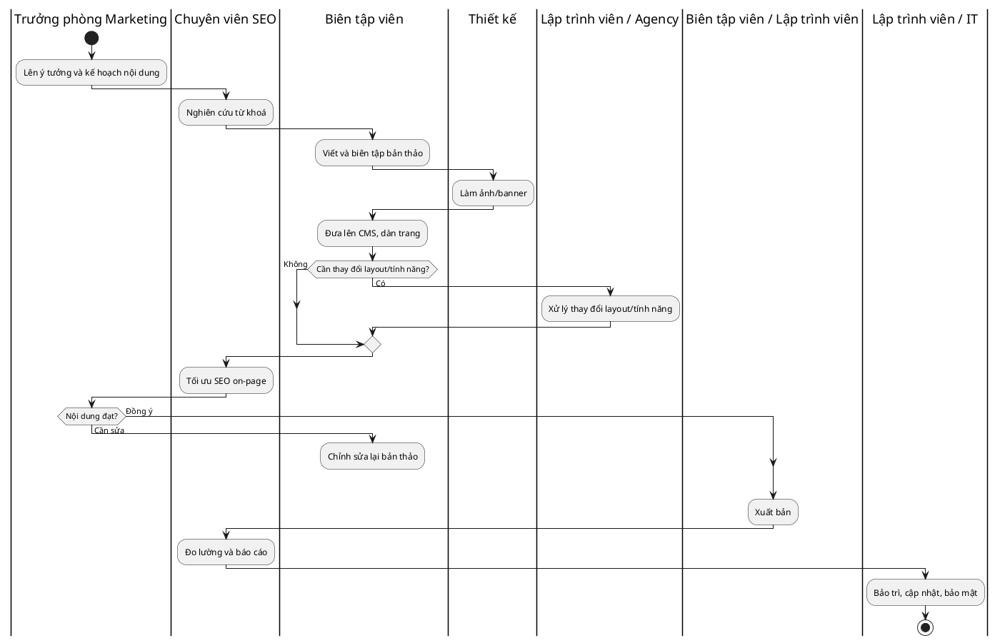

# Quy trình Hiện trạng (As-Is) — Quản lý nội dung của đội marketing mid-market VN

**Dự án:** marketing-cms-saas · **Ngày:** 18/06/2026 · **Phiên bản:** v0.1
**Phạm vi:** Mô tả cách một đội marketing doanh nghiệp vừa ở VN hiện tạo–duyệt–phát hành–đo lường nội dung website. Đây là "as-is" của **khách hàng mục tiêu** (vì sản phẩm là SaaS bán ra ngoài), tổng hợp từ phân tích đối thủ và thực hành phổ biến; cần xác thực bằng phỏng vấn thật (xem `interview-guide.md`).

## 1. Bối cảnh
Phần lớn site marketing mid-market VN chạy trên WordPress (do agency dựng) hoặc nền commerce-SaaS (Haravan/Sapo). Đội marketing muốn tự chủ nội dung nhưng thường vướng kỹ thuật, phải nhờ dev/agency cho thay đổi không tầm thường.

## 2. Tác nhân (Actors)
| Tác nhân | Trách nhiệm |
|---|---|
| Trưởng phòng Marketing | Duyệt nội dung, chịu KPI, quyết định công cụ/ngân sách |
| Biên tập viên / Content | Viết, biên tập, đưa nội dung lên CMS |
| Chuyên viên SEO | Tối ưu từ khoá, meta, theo dõi thứ hạng |
| Thiết kế | Làm ảnh/banner |
| Lập trình viên / IT (hoặc agency) | Thay đổi cần code: layout, tính năng, sửa lỗi, cập nhật/bảo mật |

## 3. Quy trình As-Is (các bước)

| # | Bước | Người làm | Đầu vào | Đầu ra | Phạm vi VietCMS |
|---|---|---|---|---|---|
| 1 | Lên ý tưởng & kế hoạch nội dung | Trưởng phòng + Content | Mục tiêu marketing | Brief nội dung | Trong (về sau) |
| 2 | Nghiên cứu từ khoá/SEO | SEO | Brief | Danh sách từ khoá | Trong |
| 3 | Viết & biên tập | Content | Brief, từ khoá | Bản thảo (Word/Docs) | Trong |
| 4 | Làm ảnh/banner | Thiết kế | Bản thảo | Tài nguyên hình ảnh | Trong (AI ảnh) |
| 5 | Đưa lên CMS, dàn trang | Content (đôi khi cần dev) | Bản thảo + ảnh | Trang nháp | Trong (no-code editor) |
| 6 | Thay đổi layout/tính năng | **Dev/Agency** | Yêu cầu | Trang đã chỉnh | Trong (thay thế phụ thuộc dev) |
| 7 | Tối ưu SEO on-page | SEO | Trang nháp | Meta/sitemap | Trong (AI SEO) |
| 8 | Duyệt nội dung | Trưởng phòng | Trang nháp | Phê duyệt/Phản hồi | Trong (workflow duyệt) |
| 9 | Xuất bản | Content/Dev | Trang đã duyệt | Trang công khai | Trong (1-click publish) |
| 10 | Đo lường & báo cáo | SEO/Content | GA4, Search Console | Báo cáo hiệu quả | Trong (analytics tích hợp) |
| 11 | Bảo trì/cập nhật/bảo mật | **Dev/IT/Agency** | Cảnh báo, bản vá | Site an toàn | Ngoài (managed SaaS lo hộ) |

## 4. Sơ đồ luồng theo vai trò (PlantUML swimlane)

Quy trình As-Is liên quan nhiều vai trò nên được biểu diễn bằng sơ đồ phân làn (swimlane).

## 5. Điểm đau (Pain Points)

| # | Điểm đau | Hệ quả | Yêu cầu ứng viên liên quan |
|---|---|---|---|
| P1 | Phụ thuộc dev/agency cho thay đổi không tầm thường (bước 6) | Chậm ra thị trường, tốn chi phí lặp lại | No-code editor (REQ 1, 13) |
| P2 | Gánh nặng bảo mật/cập nhật WordPress (bước 11) | Rủi ro bị hack, chi phí bảo trì | Managed secure SaaS (REQ 2) |
| P3 | SEO/hiệu năng phải lắp ghép nhiều plugin/công cụ | Phức tạp, kết quả không ổn định | SEO/perf mặc định + AI SEO (REQ 9, 10, 11) |
| P4 | Viết nội dung tốn thời gian, AI tiếng Việt yếu | Năng suất thấp | AI nội dung tiếng Việt (REQ 8) |
| P5 | TCO cao & khó dự đoán (hosting + plugin + dev) | Vượt ngân sách | Giá VND thấp, minh bạch (REQ 5, 19) |
| P6 | Công cụ rời rạc (builder, SEO, analytics, form) | Chuyển đổi qua lại, dữ liệu phân mảnh | Nền tảng tích hợp (REQ 18, 22, 24) |
| P7 | Nền tảng quốc tế không bản địa (thanh toán, hỗ trợ, kênh VN) | Khó vận hành ở VN | Bản địa hoá VN (REQ 3, 4, 16, 17) |
| P8 | Quy trình duyệt/cộng tác rời rạc (qua chat/email) | Mất kiểm soát phiên bản, khó truy vết | Workflow duyệt + phân quyền (REQ 14, 20) |

## 6. Hướng To-Be (tóm tắt — chi tiết ở Pha 3)
VietCMS gộp các bước 2–10 vào một nền tảng no-code: biên tập viên tự dàn trang, AI hỗ trợ nội dung & SEO, duyệt trong hệ thống, xuất bản 1-click; bước 6 (phụ thuộc dev) và bước 11 (bảo trì/bảo mật) được loại bỏ/managed. Quy trình To-Be đầy đủ sẽ mô hình hoá ở Pha 3.
