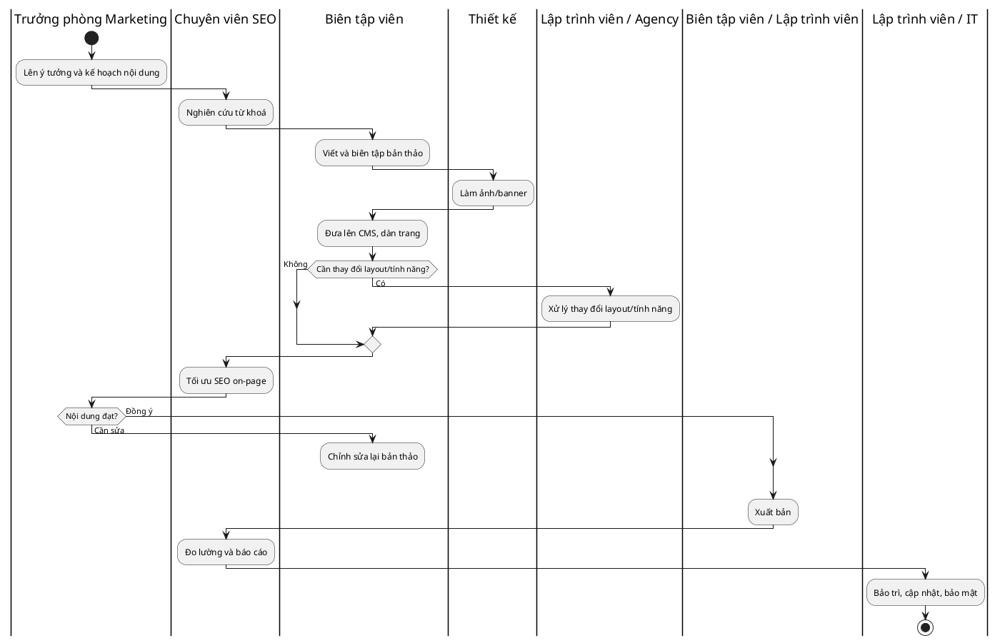
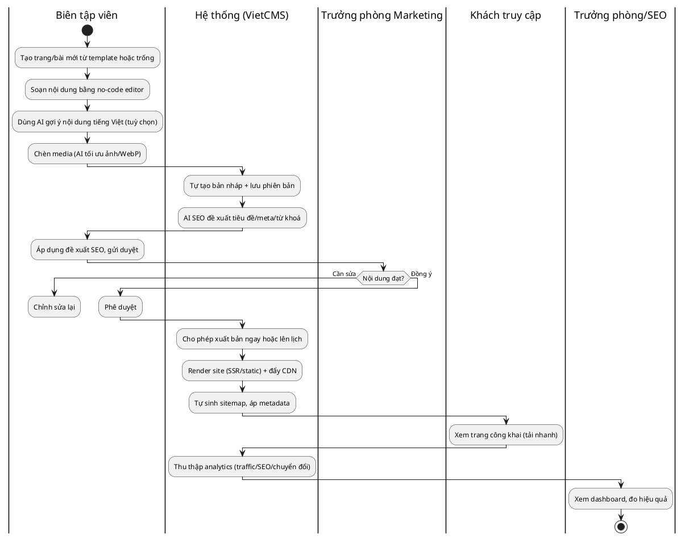

# Business Requirements Document (BRD) — Tài liệu Yêu cầu Nghiệp vụ

**Dự án:** VietCMS (marketing-cms-saas) — Hệ thống Quản trị Nội dung dạng dịch vụ phần mềm  ·  **Ngày:** 18/06/2026  ·  **Phiên bản:** v0.1  ·  **Đơn vị/Công ty:** Phòng Phân tích Nghiệp vụ

---

## 1. Lịch sử thay đổi (Document Revisions)

| Ngày | Phiên bản | Nội dung thay đổi | Người thực hiện |
|---|---|---|---|
| 18/06/2026 | v0.1 | Bản nháp đầu tiên, tổng hợp từ Pha 1, phân tích đối thủ và mô tả hiện trạng. | Phân tích viên Nghiệp vụ |

## 2. Phê duyệt (Approvals)

| Vai trò | Họ tên | Chức danh | Chữ ký | Ngày |
|---|---|---|---|---|
| Nhà tài trợ dự án (Sponsor) | | | | |
| Quản lý nghiệp vụ (Business Owner) | | | | |
| Quản lý dự án (PM) | | | | |
| Kiến trúc sư hệ thống | | | | |
| Trưởng nhóm phát triển | | | | |
| Trưởng nhóm UX | | | | |
| Trưởng nhóm QA | | | | |

---

# 3. Giới thiệu (Introduction)

## 3.1 Tổng quan dự án

### 3.1.1 Mục tiêu (Objectives — SMART)
- **BO-01:** Ra mắt Sản phẩm Khả dụng Tối thiểu (MVP) một Hệ thống Quản trị Nội dung dạng dịch vụ phần mềm đa khách thuê trong vòng sáu tháng, đủ để một biên tập viên không chuyên kỹ thuật dựng và phát hành một trang web nội dung hoàn chỉnh mà không cần lập trình viên.
- **BO-02:** Đạt thời gian tự xuất bản trang đầu tiên dưới ba mươi phút cho người dùng mới, tính đến hết tháng thứ bảy.
- **BO-03:** Ký kết tối thiểu mười khách hàng trả phí thuộc phân khúc doanh nghiệp vừa trong ba tháng sau khi ra mắt MVP.
- **BO-04:** Trang được hệ thống xuất bản đạt điểm hiệu năng Lighthouse từ chín mươi trở lên trên thiết bị di động ở cấu hình mặc định.

### 3.1.2 Bối cảnh (Background)
Đội ngũ tiếp thị tại các doanh nghiệp vừa ở Việt Nam bị phụ thuộc vào lập trình viên hoặc đơn vị thiết kế khi muốn thay đổi nội dung trang web, đồng thời gánh chi phí và rủi ro bảo mật của nền tảng WordPress, hoặc sử dụng nền tảng quốc tế vốn đắt đỏ và chưa được bản địa hoá. Lợi ích kỳ vọng: đội ngũ tiếp thị tự chủ xuất bản nội dung, giảm tổng chi phí sở hữu và rút ngắn thời gian đưa nội dung ra thị trường.

#### Business Drivers (Yếu tố thúc đẩy)
- **Thị trường:** chưa có một hệ thống quản trị nội dung không cần lập trình được bản địa hoá cho Việt Nam; các nền tảng nội địa thiên về thương mại điện tử, còn LadiPage chỉ phục vụ trang đích.
- **Vận hành:** nền tảng WordPress đang trong khủng hoảng bảo mật và bảo trì, với khoảng mười một nghìn lỗ hổng mới mỗi năm và khoảng mười ba nghìn trang web bị tấn công mỗi ngày.
- **Tài chính:** tổng chi phí sở hữu cao, giá nền tảng quốc tế quy đổi sang đồng Việt Nam đắt đỏ.
- **Công nghệ:** công cụ trí tuệ nhân tạo hỗ trợ nội dung và tối ưu công cụ tìm kiếm cho tiếng Việt còn bị bỏ trống ở các nền tảng nội địa.

#### Căn cứ pháp lý
| STT | Căn cứ pháp lý | Nội dung liên quan trực tiếp đến hệ thống (module nào) | Link |
|---|---|---|---|
| 1 | Nghị định 13/2023/NĐ-CP về bảo vệ dữ liệu cá nhân | Thu thập, lưu trữ và xử lý dữ liệu khách tiềm năng và người dùng; cơ chế đồng thuận và xoá dữ liệu — áp cho module Biểu mẫu/Khách tiềm năng, Tài khoản và Phân tích. | https://datafiles.chinhphu.vn |
| 2 | Luật An toàn thông tin mạng 2015 | Bảo mật hệ thống đa khách thuê, kiểm soát truy cập và phiên làm việc. | https://vanban.chinhphu.vn |

## 3.2 Phạm vi dự án (Project Scope)

### 3.2.1 Danh sách chức năng trong phạm vi (In-Scope)

| STT | Mã CN | Tên chức năng | Mô tả | Đối tượng | Ghi chú (tích hợp/ràng buộc) |
|---|:---:|---|---|---|---|
| **Nhóm 1: Quản lý nội dung** | | | | | |
| 1 | CN-01 | Trình soạn thảo không cần lập trình | Tạo và dàn trang bằng thao tác kéo–thả theo khối. | Biên tập viên | Lõi sản phẩm |
| 2 | CN-02 | Quản lý trang, bài viết, danh mục | Tạo, sửa, phân loại nội dung. | Biên tập viên | |
| 3 | CN-03 | Thư viện tài nguyên | Quản lý ảnh và video. | Biên tập viên, Thiết kế | Tự tối ưu WebP, CDN |
| 4 | CN-04 | Trang đích và biểu mẫu thu khách tiềm năng | Tạo trang đích và biểu mẫu thu thập dữ liệu. | Tiếp thị | Tuân thủ NĐ 13/2023 |
| 5 | CN-05 | Kho giao diện mẫu bản địa theo ngành | Khởi tạo nhanh từ mẫu theo ngành. | Khách hàng | |
| 6 | CN-06 | Trí tuệ nhân tạo tạo trang web | Sinh trang web nháp từ mô tả doanh nghiệp. | Khách hàng mới | Phụ thuộc dịch vụ AI |
| **Nhóm 2: Duyệt và phân quyền** | | | | | |
| 7 | CN-07 | Luồng tạo, duyệt và phát hành | Quy trình duyệt nội dung trong hệ thống. | Biên tập, Trưởng phòng | |
| 8 | CN-08 | Phân quyền theo vai trò | Kiểm soát truy cập theo vai trò. | Quản trị viên | |
| 9 | CN-09 | Quản lý đa trang web và không gian làm việc | Vận hành nhiều trang web tập trung. | Quản trị, Đại lý | |
| 10 | CN-10 | Nhãn trắng và tính phí đa khách thuê | Bán lại cho đại lý dưới thương hiệu riêng. | Đại lý | Ưu tiên Tương lai |
| **Nhóm 3: Tối ưu công cụ tìm kiếm và trí tuệ nhân tạo** | | | | | |
| 11 | CN-11 | Trí tuệ nhân tạo viết nội dung tiếng Việt | Sinh và tối ưu nội dung tiếng Việt. | Biên tập viên | Phụ thuộc dịch vụ AI |
| 12 | CN-12 | Trí tuệ nhân tạo tối ưu công cụ tìm kiếm | Đề xuất tiêu đề, thẻ mô tả, từ khoá, dữ liệu cấu trúc. | Chuyên viên SEO | |
| 13 | CN-13 | Tối ưu hiển thị trên công cụ tìm kiếm trí tuệ nhân tạo | Đón đầu xu hướng AI-search. | Tiếp thị | Ưu tiên thấp |
| 14 | CN-14 | Trí tuệ nhân tạo tạo và tối ưu hình ảnh | Sinh và tối ưu ảnh. | Thiết kế | |
| 15 | CN-15 | Quản lý thẻ và tự sinh sơ đồ trang | Tối ưu công cụ tìm kiếm mặc định. | Chuyên viên SEO | |
| 16 | CN-16 | Đa ngôn ngữ kèm thẻ hreflang | Phục vụ khách quốc tế. | Biên tập viên | Ưu tiên thấp |
| **Nhóm 4: Xuất bản và tên miền** | | | | | |
| 17 | CN-17 | Xuất bản trang công khai kèm tên miền tuỳ chỉnh | Đưa nội dung ra công khai. | Biên tập, Quản trị | SSR/static + CDN |
| 18 | CN-18 | Lên lịch xuất bản và xem trước | Chủ động thời điểm xuất bản. | Biên tập viên | |
| **Nhóm 5: Tích hợp và phân tích** | | | | | |
| 19 | CN-19 | Tích hợp cổng thanh toán nội địa | VNPay, MoMo, ZaloPay. | Khách hàng | Tối thiểu một cổng cho MVP |
| 20 | CN-20 | Tích hợp kênh và phân tích | Zalo, Facebook, công cụ phân tích, quản lý khách hàng. | Tiếp thị | Ưu tiên trung bình |
| 21 | CN-21 | Giao diện lập trình ứng dụng dạng headless | Truy cập nội dung qua API. | Lập trình viên | Ưu tiên Tương lai |
| 22 | CN-22 | Bảng điều khiển phân tích | Lưu lượng, công cụ tìm kiếm, chuyển đổi. | Trưởng phòng, SEO | |
| **Nhóm 6: Tài khoản, gói và thanh toán** | | | | | |
| 23 | CN-23 | Quản lý gói đăng ký và thanh toán định kỳ | Vận hành mô hình dịch vụ phần mềm. | Quản trị viên | |
| 24 | CN-24 | Gói miễn phí dùng được và giá minh bạch | Trải nghiệm trước khi trả phí. | Khách hàng | |

### 3.2.2 Ngoài phạm vi (Out-of-Scope)
- Tính năng thương mại điện tử, giỏ hàng và quản lý đơn hàng.
- Chợ giao diện và phần mở rộng của bên thứ ba.
- Đa ngôn ngữ ngoài tiếng Việt và tiếng Anh.
- Tích hợp chuyên sâu với hệ thống quản lý quan hệ khách hàng và tự động hoá tiếp thị.
- Ứng dụng di động gốc, kiểm thử A/B và cá nhân hoá nâng cao.
- Di trú dữ liệu tự động từ WordPress hoặc Wix.

## 3.3 Góc nhìn hệ thống (System Perspective)

### Assumptions (Giả định)
- Tồn tại nhu cầu thị trường thực tế tại phân khúc doanh nghiệp vừa cho một hệ thống quản trị nội dung bản địa giá thấp; cần xác thực qua hoạt động tìm hiểu khách hàng.
- Đội ngũ đủ năng lực xây dựng kiến trúc đa khách thuê trong khung thời gian sáu tháng.
- Có thể tích hợp tối thiểu một cổng thanh toán nội địa trong thời gian phát triển MVP.

### Constraints (Ràng buộc)
- Ngân sách hạn chế, ưu tiên dùng dịch vụ được quản lý sẵn có thay vì tự xây dựng.
- Thời gian phát triển MVP trong khoảng sáu tháng.
- Kiến trúc đa khách thuê phải bảo đảm hiệu năng và tối ưu công cụ tìm kiếm.
- Tuân thủ Nghị định 13/2023/NĐ-CP về bảo vệ dữ liệu cá nhân.

### Risks (Rủi ro)
- Cạnh tranh từ các nền tảng lớn dẫn đến khó giành thị phần.
- Nguy cơ không đạt được sự phù hợp giữa sản phẩm và thị trường.
- Nguy cơ vượt ngân sách hoặc thời gian.
- Chi phí dịch vụ trí tuệ nhân tạo tăng theo quy mô.

### Issues (Vấn đề đang tồn tại)
- Chưa tiếp cận được khách hàng thực tế để phỏng vấn, do đó mức sẵn sàng chi trả và thứ tự ưu tiên tính năng chưa được xác thực.

## 3.4 Đối tượng sử dụng và vai trò (Actors)
| STT | Tên tác nhân | Vai trò / trách nhiệm |
|---|---|---|
| 1 | Khách truy cập (không đăng nhập) | - Xem trang web công khai · gửi biểu mẫu liên hệ |
| 2 | Cộng tác viên | - Tạo nội dung; không có quyền xuất bản |
| 3 | Biên tập viên | - Tạo, sửa, gửi duyệt và xuất bản nội dung |
| 4 | Trưởng phòng tiếp thị | - Duyệt nội dung; xem báo cáo phân tích; chịu trách nhiệm chỉ tiêu |
| 5 | Quản trị viên (của khách thuê) | - Quản lý người dùng, phân quyền, trang web, gói và thanh toán |
| 6 | Hệ thống VietCMS | - Tự động dựng trang, tối ưu công cụ tìm kiếm, trí tuệ nhân tạo, tính phí và phân tích |

---

# 4. Tổng quan quy trình nghiệp vụ (Business Process Overview)

## 4.1 Quy trình hiện tại (As-Is)

Phần lớn trang web tiếp thị của doanh nghiệp vừa tại Việt Nam chạy trên WordPress do đơn vị thiết kế dựng, hoặc trên nền thương mại điện tử dạng dịch vụ. Đội ngũ tiếp thị muốn tự chủ nội dung nhưng thường vướng kỹ thuật và phải nhờ lập trình viên cho các thay đổi không tầm thường. Quy trình liên quan nhiều vai trò nên được biểu diễn bằng sơ đồ phân làn (swimlane).

**Bảng mô tả các bước (As-Is):**

| Mã bước | Tên bước | Thực hiện (ai) | Diễn giải | Phạm vi |
|---|---|---|---|---|
| BĐ | Bắt đầu | Trưởng phòng | Phát sinh nhu cầu nội dung | — |
| B1 | Lên ý tưởng và kế hoạch | Trưởng phòng, Biên tập | Xác định chủ đề, mục tiêu | Trong phạm vi |
| B2 | Nghiên cứu từ khoá | Chuyên viên SEO | Lập danh sách từ khoá | Trong phạm vi |
| B3 | Viết và biên tập | Biên tập viên | Soạn bản thảo | Trong phạm vi |
| B4 | Làm hình ảnh | Thiết kế | Chuẩn bị ảnh, biểu ngữ | Trong phạm vi |
| B5 | Đưa lên hệ thống, dàn trang | Biên tập viên | Dựng trang nháp | Trong phạm vi |
| B6 | Thay đổi bố cục/tính năng | Lập trình viên / Agency | Tuỳ chỉnh cần viết mã | Ngoài phạm vi (thay thế bằng no-code) |
| B7 | Tối ưu công cụ tìm kiếm | Chuyên viên SEO | Thẻ mô tả, sơ đồ trang | Trong phạm vi |
| B8 | Duyệt nội dung | Trưởng phòng | Phê duyệt hoặc trả lại | Trong phạm vi |
| B9 | Xuất bản | Biên tập / Lập trình viên | Đưa ra công khai | Trong phạm vi |
| B10 | Đo lường và báo cáo | Chuyên viên SEO | Đánh giá hiệu quả | Trong phạm vi |
| B11 | Bảo trì, cập nhật, bảo mật | Lập trình viên / IT | Vá lỗi, cập nhật | Ngoài phạm vi (dịch vụ được quản lý lo) |
| KT | Kết thúc | — | Nội dung đã xuất bản và được đo lường | — |

**Điểm hạn chế chính:** phụ thuộc lập trình viên (B6); gánh nặng bảo mật và bảo trì (B11); tối ưu công cụ tìm kiếm phải lắp ghép phần mở rộng; trí tuệ nhân tạo tiếng Việt còn yếu; tổng chi phí sở hữu cao; công cụ rời rạc; nền tảng quốc tế chưa bản địa hoá; quy trình duyệt rời rạc.

## 4.2 Quy trình đề xuất (To-Be)

Hệ thống VietCMS gộp các bước nội dung vào một nền tảng không cần lập trình, loại bỏ phụ thuộc lập trình viên và chuyển bảo trì/bảo mật sang chế độ dịch vụ được quản lý.

**Bảng mô tả các bước (To-Be):**

| Mã bước | Tên bước | Thực hiện (ai) | Diễn giải | Phạm vi |
|---|---|---|---|---|
| BĐ | Bắt đầu | Biên tập viên | Bắt đầu tạo nội dung | — |
| B1 | Tạo và soạn nội dung no-code | Biên tập viên | Kéo–thả khối, chèn media | Trong phạm vi |
| B2 | Trí tuệ nhân tạo hỗ trợ nội dung và SEO | Hệ thống | Gợi ý nội dung, tiêu đề, thẻ mô tả | Trong phạm vi |
| B3 | Gửi duyệt | Biên tập viên | Chuyển trạng thái chờ duyệt | Trong phạm vi |
| B4 | Phê duyệt | Trưởng phòng | Duyệt hoặc trả lại kèm ghi chú | Trong phạm vi |
| B5 | Xuất bản hoặc lên lịch | Hệ thống | Dựng trang, đẩy CDN, sinh sơ đồ trang | Trong phạm vi |
| B6 | Đo lường | Hệ thống, Trưởng phòng/SEO | Thu thập và hiển thị phân tích | Trong phạm vi |
| KT | Kết thúc | — | Nội dung công khai, được đo lường, hệ thống tự bảo trì | — |

**Điểm cải tiến:** loại bỏ phụ thuộc kỹ thuật; tăng năng suất nhờ trí tuệ nhân tạo; tối ưu công cụ tìm kiếm mặc định; kiểm soát phiên bản và truy vết; chủ động thời điểm xuất bản; giảm rủi ro và chi phí bảo trì; dữ liệu phân tích tập trung.

---

# 5. Yêu cầu nghiệp vụ (Business Requirements)

**Thang ưu tiên:**

| Value | Rating | Mô tả |
|---|---|---|
| 1 | Critical | Cực kỳ quan trọng; dự án không khả thi nếu thiếu |
| 2 | High | Ưu tiên cao; vẫn triển khai mức tối thiểu được nếu thiếu |
| 3 | Medium | Mang lại giá trị nhất định; dự án vẫn tiếp tục được |
| 4 | Low | Ưu tiên thấp / nên có nếu thời gian và chi phí cho phép |
| 5 | Future | Ngoài phạm vi lần này; xem xét cho bản phát hành tương lai |

## 5.1 Yêu cầu chức năng (Functional Requirements)

| Mã yêu cầu | Ưu tiên | Người dùng chính | Mô tả yêu cầu | Lý do (Rationale) | Mã CN | Stakeholder ảnh hưởng |
|---|:---:|---|---|---|:---:|---|
| **Nhóm: Quản lý nội dung** | | | | | | |
| FR-G-001 | 1 | Biên tập viên | Cho phép tạo và dàn trang bằng trình kéo–thả theo khối; tự lưu bản nháp và tạo phiên bản. | Năng lực không cần lập trình cốt lõi | CN-01 | Biên tập viên |
| FR-G-002 | 1 | Biên tập viên | Quản lý trang, bài viết và danh mục; đường dẫn rút gọn duy nhất trong một trang web. | Nền tảng quản trị nội dung | CN-02 | Biên tập viên |
| FR-G-003 | 2 | Biên tập viên | Quản lý thư viện ảnh và video; tự tối ưu định dạng WebP. | Quản lý tài nguyên | CN-03 | Biên tập, Thiết kế |
| FR-G-004 | 2 | Tiếp thị | Tạo trang đích và biểu mẫu thu khách tiềm năng có xác thực. | Bổ khuyết hạn chế của LadiPage | CN-04 | Tiếp thị |
| FR-G-006 | 3 | Khách hàng | Cung cấp kho giao diện mẫu bản địa theo ngành. | Tương đương kho giao diện đối thủ nội địa | CN-05 | Khách hàng |
| FR-G-005 | 4 | Khách hàng | Trí tuệ nhân tạo sinh trang web nháp từ mô tả doanh nghiệp. | Tăng tỷ lệ kích hoạt | CN-06 | Khách hàng mới |
| **Nhóm: Duyệt và phân quyền** | | | | | | |
| FR-W-001 | 1 | Biên tập, Trưởng phòng | Luồng tạo, duyệt và phát hành; chỉ nội dung đã duyệt mới xuất bản. | Thay thế quy trình duyệt rời rạc | CN-07 | Trưởng phòng |
| FR-W-002 | 1 | Quản trị viên | Phân quyền theo vai trò; áp ma trận phân quyền. | Kiểm soát truy cập và cộng tác an toàn | CN-08 | Quản trị viên |
| FR-W-003 | 2 | Quản trị, Đại lý | Quản lý nhiều trang web trong một không gian làm việc. | Phục vụ doanh nghiệp đa thương hiệu và đại lý | CN-09 | Đại lý |
| FR-W-004 | 5 | Đại lý | Nhãn trắng và tính phí đa khách thuê cho đại lý. | Kênh đại lý còn bỏ ngỏ tại Việt Nam | CN-10 | Đại lý |
| **Nhóm: Tối ưu công cụ tìm kiếm và trí tuệ nhân tạo** | | | | | | |
| FR-AI-001 | 2 | Biên tập viên | Trí tuệ nhân tạo viết nội dung tiếng Việt; trừ hạn mức mỗi lần dùng. | Khác biệt chính của sản phẩm | CN-11 | Biên tập viên |
| FR-AI-002 | 2 | Chuyên viên SEO | Trí tuệ nhân tạo đề xuất tiêu đề, thẻ mô tả, từ khoá, dữ liệu cấu trúc. | Năng lực còn thiếu ở nền tảng nội địa | CN-12 | Chuyên viên SEO |
| FR-AI-003 | 4 | Tiếp thị | Tối ưu hiển thị trên công cụ tìm kiếm trí tuệ nhân tạo. | Đón đầu xu hướng | CN-13 | Tiếp thị |
| FR-AI-004 | 4 | Thiết kế | Trí tuệ nhân tạo tạo và tối ưu hình ảnh sang WebP. | Lợi ích về hiệu năng | CN-14 | Thiết kế |
| FR-SEO-001 | 1 | Chuyên viên SEO | Quản lý thẻ mô tả và tự sinh sơ đồ trang khi xuất bản. | Tối ưu công cụ tìm kiếm mặc định | CN-15 | Chuyên viên SEO |
| FR-SEO-002 | 3 | Biên tập viên | Tạo phiên bản đa ngôn ngữ kèm thẻ hreflang. | Phục vụ khách quốc tế | CN-16 | Biên tập viên |
| **Nhóm: Xuất bản và tên miền** | | | | | | |
| FR-PUB-001 | 1 | Biên tập, Quản trị | Xuất bản trang công khai kèm tên miền tuỳ chỉnh; dự phòng tên miền phụ. | Kết quả đầu ra cốt lõi | CN-17 | Khách hàng |
| FR-G-007 | 3 | Biên tập viên | Lên lịch xuất bản và xem trước/staging. | Kỳ vọng của đội ngũ nội dung | CN-18 | Biên tập, Trưởng phòng |
| **Nhóm: Tích hợp và phân tích** | | | | | | |
| FR-INT-001 | 2 | Khách hàng | Tích hợp cổng thanh toán nội địa (VNPay/MoMo/ZaloPay). | Yêu cầu bản địa hoá | CN-19 | Khách hàng |
| FR-INT-002 | 3 | Tiếp thị | Tích hợp Zalo, Facebook, công cụ phân tích, quản lý khách hàng. | Kênh và đo lường tại Việt Nam | CN-20 | Tiếp thị |
| FR-INT-003 | 5 | Lập trình viên | Giao diện lập trình ứng dụng dạng headless theo phạm vi truy cập. | Thu hút nhóm lập trình viên | CN-21 | Lập trình viên |
| FR-AN-001 | 3 | Trưởng phòng, SEO | Bảng điều khiển phân tích lưu lượng, công cụ tìm kiếm, chuyển đổi. | Giảm phụ thuộc công cụ rời rạc | CN-22 | Tiếp thị, SEO |
| **Nhóm: Tài khoản, gói và thanh toán** | | | | | | |
| FR-ACC-001 | 1 | Quản trị viên | Quản lý gói đăng ký và thanh toán định kỳ; áp hạn mức theo gói. | Vận hành mô hình dịch vụ phần mềm | CN-23 | Kinh doanh, Khách hàng |
| FR-ACC-002 | 2 | Khách hàng | Gói miễn phí dùng được và giá minh bạch, không tăng khi gia hạn. | Tránh rào cản chuyển đổi và tăng giá | CN-24 | Khách hàng |

## 5.2 Yêu cầu phi chức năng (Non-Functional Requirements)

| ID | Nhóm | Yêu cầu (có ngưỡng đo / tham chiếu tuân thủ) |
|---|---|---|
| NFR-001 | Hiệu năng | Trang được xuất bản đạt điểm hiệu năng Lighthouse ≥ 90 trên thiết bị di động ở cấu hình mặc định. |
| NFR-002 | Khả dụng | Người dùng mới tự xuất bản trang đầu tiên trong dưới 30 phút. |
| NFR-003 | Khả mở rộng | Kiến trúc đa khách thuê hoạt động ổn định và cô lập dữ liệu giữa các khách hàng. |
| NFR-004 | Bảo mật | Hệ thống được quản lý hoàn toàn; người dùng không tự vá lỗi hoặc cập nhật. |
| NFR-005 | Tuân thủ | Tuân thủ Nghị định 13/2023/NĐ-CP về bảo vệ dữ liệu cá nhân (đồng thuận, lưu trữ, xoá theo yêu cầu). |
| NFR-006 | Bản địa hoá | Giao diện, tài liệu và hỗ trợ bằng tiếng Việt đầy đủ. |
| NFR-007 | Tính ổn định | Độ sẵn sàng dịch vụ ≥ 99,5%/năm. |

## 5.3 Danh sách Use Case tổng hợp *(bàn giao sang Pha 3)*

| # | Tên Use Case | Tác nhân chính | Mô tả các bước | Mã CN |
|---|---|---|---|---|
| **I. Quản lý nội dung** | | | | |
| 1 | UC-01 Soạn thảo no-code | Biên tập viên | 1. Tạo mới · 2. Kéo–thả khối · 3. Lưu nháp có phiên bản | CN-01, CN-02 |
| 2 | UC-05 Tạo site từ template/AI | Quản trị, Biên tập | 1. Chọn mẫu hoặc nhập mô tả · 2. Sinh site nháp · 3. Tinh chỉnh | CN-05, CN-06 |
| **II. Duyệt và phân quyền** | | | | |
| 3 | UC-02 Duyệt nội dung | Biên tập, Trưởng phòng | 1. Gửi duyệt · 2. Xem · 3. Duyệt/Từ chối | CN-07 |
| 4 | UC-06 Quản lý người dùng | Quản trị viên | 1. Mời · 2. Gán vai trò · 3. Kích hoạt | CN-08, CN-09 |
| **III. SEO và trí tuệ nhân tạo** | | | | |
| 5 | UC-04 AI nội dung và SEO | Biên tập viên | 1. Nhập ngữ cảnh · 2. Sinh nội dung · 3. Áp dụng SEO | CN-11, CN-12, CN-14, CN-15 |
| **IV. Xuất bản và tên miền** | | | | |
| 6 | UC-03 Xuất bản/lên lịch | Biên tập, Quản trị | 1. Chọn xuất bản · 2. Dựng trang + CDN · 3. Sinh sơ đồ trang | CN-17, CN-18 |
| **V. Tích hợp và phân tích** | | | | |
| 7 | UC-08 Gửi biểu mẫu thu lead | Khách truy cập | 1. Điền · 2. Xác thực · 3. Lưu lead | CN-04, CN-20 |
| 8 | UC-09 Xem dashboard phân tích | Trưởng phòng, SEO | 1. Chọn khoảng thời gian · 2. Hiển thị chỉ số | CN-22 |
| **VI. Tài khoản, gói và thanh toán** | | | | |
| 9 | UC-07 Gói và thanh toán | Quản trị viên | 1. Chọn gói · 2. Thanh toán nội địa · 3. Kích hoạt | CN-19, CN-23, CN-24 |
| **VII. Mở rộng (ngoài MVP)** | | | | |
| 10 | UC-10 Đa ngôn ngữ, API, nhãn trắng | Biên tập, Quản trị, Lập trình | 1. Bật tính năng · 2. Cấu hình theo phạm vi | CN-16, CN-21, CN-10 |

---

# 6. Phụ lục (Appendices)

## 6.1 Thuật ngữ (Glossary)
| STT | Thuật ngữ | Giải thích | Nguồn tham chiếu |
|---|---|---|---|
| 1 | Hệ thống Quản trị Nội dung (CMS) | Phần mềm cho phép tạo và quản lý nội dung trang web. | — |
| 2 | Không cần lập trình (No-code) | Tạo và sửa giao diện cùng nội dung mà không cần viết mã. | — |
| 3 | Đa khách thuê (Multi-tenant) | Một hệ thống phục vụ nhiều khách hàng với dữ liệu được cô lập. | — |
| 4 | Tối ưu công cụ tìm kiếm (SEO) | Tối ưu để trang xuất hiện tốt trên công cụ tìm kiếm. | — |
| 5 | Tối ưu công cụ tìm kiếm trí tuệ nhân tạo (AEO) | Tối ưu hiển thị trên các công cụ tìm kiếm dùng trí tuệ nhân tạo. | competitor-analysis.md |
| 6 | Tổng chi phí sở hữu (TCO) | Tổng chi phí để sở hữu và vận hành giải pháp. | — |
| 7 | Sản phẩm Khả dụng Tối thiểu (MVP) | Phiên bản tối thiểu đủ dùng để xác thực thị trường. | — |

## 6.2 Tài liệu liên quan (Related Documents)
- Pha 1: product-vision.md, scope-statement.md, business-case.md.
- Pha 2: competitor-analysis.md, as-is-process.md, requirements-log.csv, interview-guide.md.
- Pha 3 (bàn giao): srs.md, use-cases.md, user-stories.md, modeling.md, traceability-matrix.csv.
