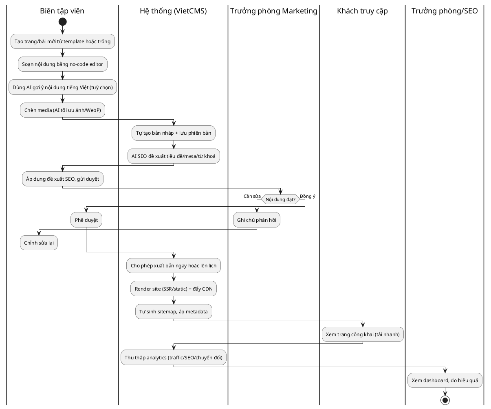
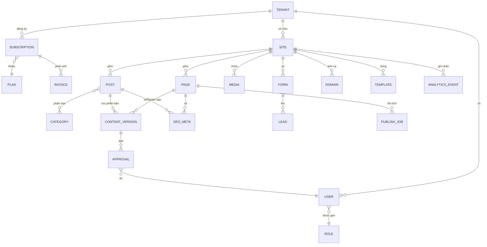

# Mô hình hoá To-be & Data Model — marketing-cms-saas (VietCMS)

**Dự án:** marketing-cms-saas · **Ngày:** 18/06/2026 · **Phiên bản:** v0.1
**Đầu vào:** as-is-process.md, brd.md, requirements-log.csv (Pha 2).

## 1. Quy trình To-be — Tạo & Phát hành nội dung

So với As-is: loại bỏ bước phụ thuộc dev (As-is bước 6) và bảo trì/bảo mật thủ công (As-is bước 11); gộp soạn thảo–SEO–duyệt–xuất bản vào một nền tảng no-code; thêm hỗ trợ AI ở khâu viết & SEO.

### 1.1 Sơ đồ swimlane (PlantUML)

### 1.2 Điểm cải tiến/tự động hoá so với As-is
| As-is | To-be | Yêu cầu liên quan |
|---|---|---|
| Phụ thuộc dev để đổi layout/tính năng | Biên tập tự dàn trang no-code | FR-G-001 |
| Viết tay tốn thời gian | AI gợi ý nội dung tiếng Việt | FR-AI-001 |
| SEO lắp ghép plugin | SEO mặc định + AI SEO | FR-SEO-001, FR-AI-002 |
| Duyệt qua chat/email rời rạc | Workflow duyệt trong hệ thống | FR-W-001 |
| Xuất bản cần dev | Xuất bản 1-click + lên lịch | FR-PUB-001, FR-G-007 |
| Bảo trì/bảo mật thủ công | Managed SaaS | NFR-004 |
| Công cụ analytics rời | Dashboard tích hợp | FR-AN-001 |

## 2. Data Model (ERD)

### 2.1 Sơ đồ thực thể (Mermaid)

### 2.2 Mô tả thực thể chính
| Thực thể | Mô tả | Thuộc tính chính |
|---|---|---|
| TENANT | Khách hàng (tổ chức) trong mô hình multi-tenant | id, tên, trạng thái, ngày tạo |
| USER | Người dùng thuộc tenant | id, tenant_id, email, role_id, trạng thái |
| ROLE | Vai trò phân quyền | id, tên (Admin/Editor/Contributor/Viewer), quyền |
| SITE | Một website của tenant | id, tenant_id, tên, template_id, trạng thái |
| PAGE / POST | Trang tĩnh / bài viết | id, site_id, tiêu đề, slug, trạng thái (draft/review/published/scheduled) |
| CONTENT_VERSION | Phiên bản nội dung (versioning) | id, parent_id, nội dung, tác giả, timestamp |
| APPROVAL | Bản ghi duyệt nội dung | id, version_id, người duyệt, kết quả, ghi chú |
| SEO_META | Metadata SEO của trang/bài | id, target_id, title, description, keywords, schema |
| MEDIA | Tài nguyên ảnh/video | id, site_id, url, định dạng, kích thước |
| TEMPLATE | Mẫu giao diện (bản địa theo ngành) | id, tên, ngành, cấu trúc |
| FORM / LEAD | Form thu lead & dữ liệu lead | form: id, site_id, trường; lead: id, form_id, dữ liệu, thời điểm |
| DOMAIN | Tên miền tuỳ chỉnh ánh xạ vào site | id, site_id, domain, trạng thái DNS/SSL |
| PLAN / SUBSCRIPTION / INVOICE | Gói, đăng ký, hoá đơn (billing) | giá VND, chu kỳ, trạng thái thanh toán |
| ANALYTICS_EVENT | Sự kiện đo lường (traffic/chuyển đổi) | id, site_id, loại, thời điểm, thuộc tính |
| PUBLISH_JOB | Tác vụ xuất bản/lên lịch | id, target_id, thời điểm chạy, trạng thái |

### 2.3 Quan hệ đáng chú ý
- TENANT 1–n SITE, USER, SUBSCRIPTION → nền multi-tenant (NFR-003).
- PAGE/POST 1–n CONTENT_VERSION → versioning & rollback (hỗ trợ workflow duyệt).
- POST n–n CATEGORY.
- SITE 1–n DOMAIN → tên miền tuỳ chỉnh (FR-PUB-001).
