# TÀI LIỆU ĐẶC TẢ YÊU CẦU PHẦN MỀM (SRS)

**DỰ ÁN: VietCMS (marketing-cms-saas) — Hệ thống Quản trị Nội dung dạng dịch vụ phần mềm**

| Mã hiệu dự án | VIETCMS |
|---|---|
| Phiên bản | v0.1 |
| Mã hiệu tài liệu | VIETCMS - SRS - v0.1 |
| Địa điểm, thời gian | Hà Nội, 06/2026 |

## LỊCH SỬ THAY ĐỔI
| Ngày hiệu lực | Phiên bản | Vị trí thay đổi | Nội dung thay đổi | Lý do | Người thay đổi | Người phê duyệt |
|---|---|---|---|---|---|---|
| 18/06/2026 | v0.1 | Toàn bộ | Khởi tạo SRS từ BRD, danh sách trường hợp sử dụng và câu chuyện người dùng | Bắt đầu Pha 3 | Phân tích viên Nghiệp vụ | (chờ) |

## TRANG KÝ
| Vai trò | Họ và tên - Chức vụ | Chữ ký | Ngày |
|---|---|---|---|
| Người lập | (Phân tích viên Nghiệp vụ) | | |
| Người kiểm tra | (Trưởng nhóm QA) | | |
| Người hỗ trợ (khách hàng) | (Chủ sản phẩm) | | |
| Người duyệt | (Nhà tài trợ) | | |

---

# I. GIỚI THIỆU

## 1. Mục đích
Tài liệu này đặc tả chi tiết các yêu cầu của hệ thống VietCMS ở mức đủ để đội ngũ phát triển xây dựng và đội ngũ kiểm thử kiểm thử. Tài liệu là đầu vào chuẩn cho thiết kế kỹ thuật, lập trình và kiểm thử.

## 2. Phạm vi
VietCMS là một Hệ thống Quản trị Nội dung dạng dịch vụ phần mềm, không cần lập trình, kiến trúc đa khách thuê, được tối ưu cho thị trường Việt Nam về ngôn ngữ, hiệu năng, tối ưu công cụ tìm kiếm, trí tuệ nhân tạo và thanh toán nội địa. Mục tiêu của Sản phẩm Khả dụng Tối thiểu là giúp biên tập viên không chuyên kỹ thuật tự dựng và phát hành trang web nội dung. Mục tiêu nghiệp vụ chi tiết tham chiếu BO-01 đến BO-04 trong Tài liệu Yêu cầu Nghiệp vụ.

## 3. Đối tượng sử dụng
Tài liệu phục vụ các vai trò: người thiết kế, lập trình, kiểm thử, quản trị vận hành, cùng chủ sản phẩm và khách hàng.

## 4. Tài liệu liên quan
| STT | Tài liệu | Phiên bản | Mô tả |
|---|---|---|---|
| 1 | brd.md (Pha 2) | v0.1 | Tài liệu Yêu cầu Nghiệp vụ baseline |
| 2 | requirements-log.csv (Pha 2) | v0.1 | Nhật ký yêu cầu đã phân loại |
| 3 | as-is-process.md (Pha 2) | v0.1 | Mô tả quy trình hiện trạng |
| 4 | use-cases.md / user-stories.md (Pha 3) | v0.1 | Use case và câu chuyện người dùng |
| 5 | traceability-matrix.csv (Pha 3) | v0.1 | Ma trận truy vết |

## 5. Định nghĩa và các từ viết tắt
### 5.1 Định nghĩa
- **Không cần lập trình (No-code):** khả năng tạo và sửa giao diện cùng nội dung mà không cần viết mã.
- **Đa khách thuê (Multi-tenant):** một hệ thống phục vụ nhiều khách hàng với dữ liệu được cô lập.

### 5.2 Thuật ngữ / Từ viết tắt
| STT | Thuật ngữ | Định nghĩa |
|---|---|---|
| 1 | CMS | Hệ thống Quản trị Nội dung |
| 2 | SEO | Tối ưu công cụ tìm kiếm |
| 3 | AEO | Tối ưu hiển thị trên công cụ tìm kiếm trí tuệ nhân tạo |
| 4 | SSR | Kết xuất phía máy chủ |
| 5 | CDN | Mạng phân phối nội dung |
| 6 | NFR | Yêu cầu phi chức năng |
| 7 | BR | Quy tắc nghiệp vụ |

---

# II. MÔ TẢ TỔNG THỂ

**Tổng quan phần mềm:**
- **Góc nhìn sản phẩm:** VietCMS là sản phẩm độc lập trên nền tảng web, vận hành theo mô hình dịch vụ phần mềm đa khách thuê.
- **Chức năng sản phẩm:** sáu nhóm chức năng chính — quản lý nội dung; duyệt và phân quyền; tối ưu công cụ tìm kiếm và trí tuệ nhân tạo; xuất bản và tên miền; tích hợp và phân tích; tài khoản, gói và thanh toán.
- **Đặc điểm người dùng:** quản trị viên và biên tập viên là người dùng chính (trình độ không chuyên kỹ thuật); trưởng phòng tiếp thị duyệt nội dung; cộng tác viên tạo nội dung; khách truy cập xem trang công khai.
- **Giả định và phụ thuộc:** phụ thuộc dịch vụ trí tuệ nhân tạo bên thứ ba, cổng thanh toán nội địa và hạ tầng điện toán đám mây kèm mạng phân phối nội dung. Giả định về nhu cầu thị trường cần được xác thực.

## 1. Mô hình tổng quan

Kiến trúc khái niệm: trình duyệt của quản trị viên và biên tập viên giao tiếp với phần lõi đa khách thuê; phần lõi kết nối tới dịch vụ trí tuệ nhân tạo, cổng thanh toán, mạng phân phối nội dung và dịch vụ phân tích. Trang công khai được kết xuất phía máy chủ hoặc dạng tĩnh và phân phối qua mạng phân phối nội dung.

### 1.1 Mô tả các đối tượng/thành phần của hệ thống
- **Ứng dụng quản trị (Admin/Editor):** giao diện soạn thảo, duyệt, phân quyền, cấu hình.
- **Lõi đa khách thuê:** quản lý dữ liệu cô lập theo khách thuê, quy tắc nghiệp vụ, hàng đợi xuất bản.
- **Dịch vụ kết xuất và phân phối:** dựng trang công khai và đẩy lên mạng phân phối nội dung.
- **Dịch vụ phân tích:** thu thập và tổng hợp sự kiện đo lường.

### 1.2 Mô tả các hệ thống khác liên quan
- **Dịch vụ trí tuệ nhân tạo:** sinh nội dung tiếng Việt và đề xuất tối ưu công cụ tìm kiếm.
- **Cổng thanh toán nội địa:** VNPay, MoMo, ZaloPay.
- **Kênh và công cụ ngoài:** Zalo, Facebook, công cụ phân tích, hệ thống quản lý quan hệ khách hàng.

## 2. Luồng nghiệp vụ tổng quan

### 2.1 Sơ đồ nghiệp vụ tổng quan hệ thống

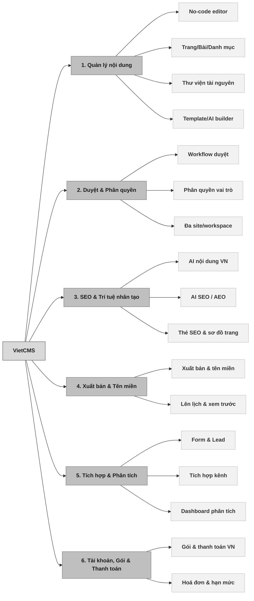

### 2.2 Use Case Diagram tổng quan

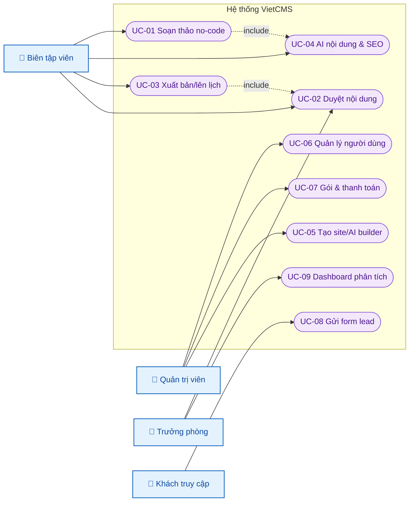

**Danh sách chức năng – Use Case:**

| STT | Tính năng | Mô tả | Chi tiết |
|---|---|---|---|
| 1 | Quản lý nội dung | Soạn thảo, quản lý trang/bài, tài nguyên | Tạo/Sửa/Xem/Xoá/Dàn trang (UC-01, UC-05) |
| 2 | Duyệt và phân quyền | Workflow duyệt và quản lý người dùng | Gửi duyệt/Duyệt/Từ chối; Mời/Phân quyền (UC-02, UC-06) |
| 3 | SEO và trí tuệ nhân tạo | Hỗ trợ nội dung và tối ưu tìm kiếm | Sinh nội dung/Đề xuất thẻ SEO/Tạo ảnh (UC-04) |
| 4 | Xuất bản và tên miền | Xuất bản, lên lịch, gắn tên miền | Xuất bản 1 thao tác/Lên lịch (UC-03) |
| 5 | Tích hợp và phân tích | Thu lead, tích hợp kênh, đo lường | Gửi biểu mẫu/Dashboard (UC-08, UC-09) |
| 6 | Tài khoản, gói, thanh toán | Quản lý gói và thanh toán nội địa | Chọn gói/Thanh toán/Hoá đơn (UC-07) |

## 3. Ma trận phân quyền
| STT | Name (Vai trò) | Description (Quyền) | Assigned User | Đối tượng |
|---|---|---|---|---|
| 1 | Quản trị viên | Đầy đủ quyền; quản lý người dùng, gói, thanh toán, trang web | | Tài khoản khách thuê |
| 2 | Biên tập viên | Tạo, sửa, gửi duyệt và xuất bản nội dung | | Nội dung |
| 3 | Trưởng phòng tiếp thị | Duyệt nội dung; xem báo cáo phân tích | | Nội dung, Báo cáo |
| 4 | Cộng tác viên | Tạo nội dung; không xuất bản | | Nội dung |
| 5 | Khách truy cập | Xem trang công khai; gửi biểu mẫu | | Trang công khai |

## 4. Sơ đồ chức năng (Site map / BFD)

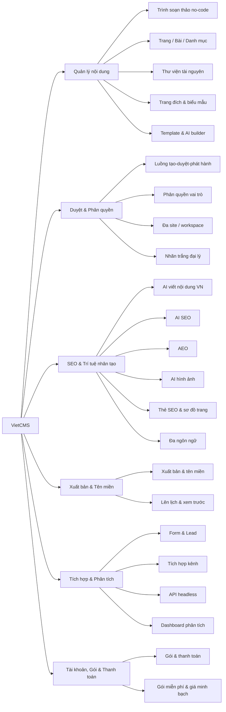

## 5. Mô hình dữ liệu (ERD)

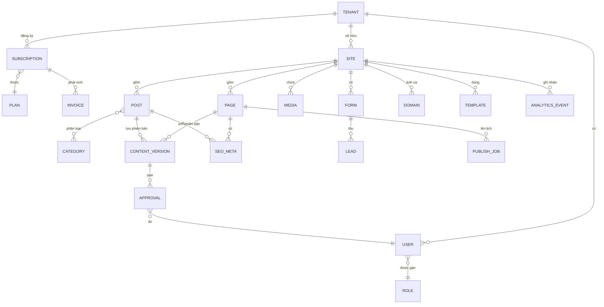

| Thực thể | Thuộc tính chính | Kiểu | Bắt buộc | Quy tắc hợp lệ |
|---|---|---|---|---|
| TENANT | id, tên, trạng thái | int, string, enum | Có | Mỗi khách thuê duy nhất |
| USER | id, tenant_id, email, role_id | int, int, string, int | Có | Email duy nhất trong khách thuê |
| ROLE | id, tên, quyền | int, string, json | Có | Theo ma trận phân quyền |
| SITE | id, tenant_id, tên, template_id | int, int, string, int | Có | Thuộc một khách thuê |
| PAGE / POST | id, site_id, tiêu đề, slug, trạng thái | int, int, string, string, enum | Có | Slug duy nhất trong site (BR-02) |
| CONTENT_VERSION | id, parent_id, nội dung, tác giả, thời điểm | int, int, text, int, datetime | Có | Tạo mới mỗi lần lưu (BR-01) |
| APPROVAL | id, version_id, người duyệt, kết quả | int, int, int, enum | Có | Gắn với người duyệt hợp lệ |
| SEO_META | id, target_id, title, description, keywords, schema | int, int, string, string, string, json | Không | Áp khi xuất bản |
| MEDIA | id, site_id, url, định dạng, kích thước | int, int, string, string, int | Có | Tự chuyển WebP |
| FORM / LEAD | id, site_id, trường / dữ liệu, thời điểm | int, int, json, datetime | Có | Tuân thủ NĐ 13/2023 |
| DOMAIN | id, site_id, domain, trạng thái | int, int, string, enum | Có | Kiểm tra DNS/SSL |
| PLAN / SUBSCRIPTION / INVOICE | giá, chu kỳ, trạng thái | money(VND), enum, enum | Có | Giá theo đồng Việt Nam |
| ANALYTICS_EVENT | id, site_id, loại, thời điểm | int, int, string, datetime | Có | — |
| PUBLISH_JOB | id, target_id, thời điểm chạy, trạng thái | int, int, datetime, enum | Có | Thời điểm không ở quá khứ |

---
# III. ĐẶC TẢ YÊU CẦU HỆ THỐNG

## 1. Yêu cầu chức năng phần mềm

### 1.1 Soạn thảo trang/bài không cần lập trình

#### 1.1.1 Mô tả chung
| Trường | Nội dung |
|---|---|
| ID | UC-01 |
| Tên | Soạn thảo trang/bài không cần lập trình |
| Mô tả | Biên tập viên tạo và dàn trang bằng trình kéo–thả theo khối |
| Tác nhân | Biên tập viên (Cộng tác viên) |
| Ưu tiên | Cao |
| Trigger | Người dùng chọn "Tạo trang/bài mới" |
| Tiền điều kiện | Đã đăng nhập; có quyền tạo nội dung; đã chọn trang web |
| Kết quả (hậu điều kiện) | Bản nháp được lưu kèm phiên bản |
| **Luồng chính** | 1. Người dùng chọn tạo mới (trống hoặc từ mẫu). 2. Hệ thống mở trình soạn thảo kéo–thả. 3. Người dùng thêm và sắp xếp khối, chèn tài nguyên. 4. Hệ thống tự lưu nháp và tạo phiên bản. 5. Người dùng đặt tiêu đề và đường dẫn. 6. Hệ thống xác thực đường dẫn duy nhất và lưu. |
| **Luồng phụ** | 3a. Gọi trí tuệ nhân tạo gợi ý nội dung (xem UC-04). 1a. Tạo từ mẫu bản địa theo ngành. |
| **Luồng ngoại lệ / kết thúc** | 6a. Đường dẫn trùng → báo lỗi, đề xuất đường dẫn thay thế. 4a. Mất kết nối → giữ bản nháp cục bộ, đồng bộ khi có mạng. |

#### 1.1.2 Luồng xử lý
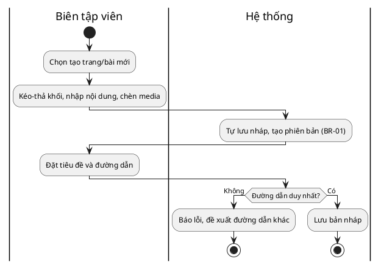

#### 1.1.3 Quy tắc xử lý nghiệp vụ
| Bước | Người thực hiện / HT | BR Code | Mô tả |
|:---:|:---:|:---:|---|
| 4 | Hệ thống | BR-01 | Mỗi lần lưu tạo một phiên bản nội dung mới, cho phép khôi phục. |
| 6 | Hệ thống | BR-02 | Đường dẫn rút gọn phải duy nhất trong phạm vi một trang web. |

#### 1.1.4 Thiết kế giao diện
| STT | Trường thông tin | Định dạng dữ liệu | Mô tả | Bắt buộc |
|---|---|---|---|---|
| 1 | Tiêu đề | Text, tối đa 200 ký tự | Tên trang/bài | x |
| 2 | Đường dẫn rút gọn | Text, chữ thường và dấu nối | Đường dẫn của trang | x |
| 3 | Vùng khối nội dung | Kéo–thả | Khu vực dàn nội dung | x |
| 4 | Trạng thái | Danh sách chọn | Bản nháp/Chờ duyệt/Đã xuất bản/Đã lên lịch | Hệ thống |

### 1.2 Gửi duyệt và phê duyệt nội dung

#### 1.2.1 Mô tả chung
| Trường | Nội dung |
|---|---|
| ID | UC-02 |
| Tên | Gửi duyệt và phê duyệt nội dung |
| Mô tả | Biên tập viên gửi nội dung; trưởng phòng duyệt hoặc trả lại |
| Tác nhân | Biên tập viên, Trưởng phòng tiếp thị |
| Ưu tiên | Cao |
| Trigger | Biên tập viên chọn "Gửi duyệt" |
| Tiền điều kiện | Có bản nháp; có vai trò người duyệt được cấu hình |
| Kết quả (hậu điều kiện) | Nội dung ở trạng thái Đã duyệt hoặc trả lại Bản nháp kèm phản hồi |
| **Luồng chính** | 1. Biên tập viên gửi bản nháp. 2. Hệ thống chuyển trạng thái chờ duyệt và thông báo người duyệt. 3. Người duyệt xem nội dung và bản so sánh phiên bản. 4. Người duyệt phê duyệt. 5. Hệ thống chuyển trạng thái Đã duyệt và lưu bản ghi duyệt. |
| **Luồng phụ** | 4a. Người duyệt từ chối kèm ghi chú → nội dung về Bản nháp, thông báo biên tập viên. |
| **Luồng ngoại lệ / kết thúc** | 2a. Trang web chưa có người duyệt → cảnh báo quản trị viên thiết lập. |

#### 1.2.2 Luồng xử lý
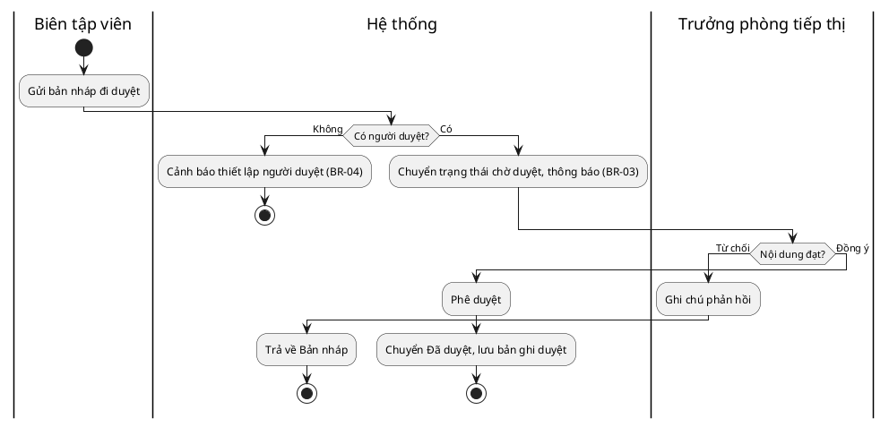

#### 1.2.3 Quy tắc xử lý nghiệp vụ
| Bước | Người thực hiện / HT | BR Code | Mô tả |
|:---:|:---:|:---:|---|
| 2 | Hệ thống | BR-03 | Thông báo tới mọi người duyệt được cấu hình của trang web. |
| 2 | Hệ thống | BR-04 | Không cho gửi duyệt nếu trang web chưa có người duyệt. |
| 5 | Hệ thống | BR-05 | Chỉ nội dung trạng thái Đã duyệt mới được xuất bản. |

#### 1.2.4 Thiết kế giao diện
| STT | Trường thông tin | Định dạng dữ liệu | Mô tả | Bắt buộc |
|---|---|---|---|---|
| 1 | Danh sách chờ duyệt | Bảng | Nội dung đang chờ duyệt | Hệ thống |
| 2 | So sánh phiên bản | Khung đối chiếu | Khác biệt giữa các phiên bản | Hệ thống |
| 3 | Ghi chú phản hồi | Text nhiều dòng | Lý do khi từ chối | x (khi từ chối) |

### 1.3 Xuất bản và lên lịch xuất bản

#### 1.3.1 Mô tả chung
| Trường | Nội dung |
|---|---|
| ID | UC-03 |
| Tên | Xuất bản và lên lịch xuất bản |
| Mô tả | Đưa nội dung đã duyệt ra công khai, ngay hoặc theo lịch |
| Tác nhân | Biên tập viên, Quản trị viên |
| Ưu tiên | Cao |
| Trigger | Chọn "Xuất bản" hoặc "Lên lịch" |
| Tiền điều kiện | Nội dung Đã duyệt; trang web có tên miền hợp lệ |
| Kết quả (hậu điều kiện) | Trang công khai online; sơ đồ trang được cập nhật |
| **Luồng chính** | 1. Người dùng chọn xuất bản. 2. Hệ thống kết xuất trang, đẩy mạng phân phối nội dung, áp thẻ tối ưu. 3. Hệ thống cập nhật sơ đồ trang và đặt trạng thái Đã xuất bản. 4. Hệ thống hiển thị đường dẫn công khai. |
| **Luồng phụ** | 1a. Lên lịch: đặt thời điểm → hệ thống tạo tác vụ và xuất bản tự động đúng giờ. 1b. Gỡ xuất bản → trạng thái về Bản nháp, loại khỏi sơ đồ trang. |
| **Luồng ngoại lệ / kết thúc** | 2a. Tên miền chưa sẵn sàng → xuất bản tạm trên tên miền phụ. 1a-x. Thời điểm lên lịch ở quá khứ → báo lỗi. |

#### 1.3.2 Luồng xử lý
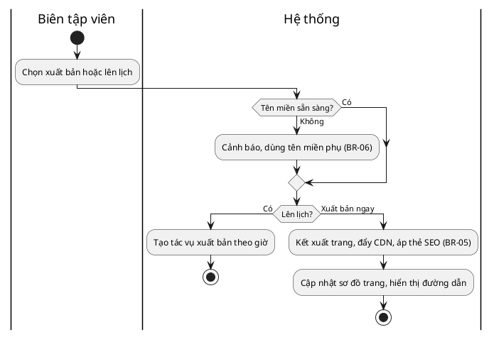

#### 1.3.3 Quy tắc xử lý nghiệp vụ
| Bước | Người thực hiện / HT | BR Code | Mô tả |
|:---:|:---:|:---:|---|
| 1 | Hệ thống | BR-05 | Chỉ nội dung Đã duyệt mới được xuất bản. |
| 2 | Hệ thống | BR-06 | Nếu tên miền chưa sẵn sàng DNS/SSL, xuất bản tạm trên tên miền phụ. |

#### 1.3.4 Thiết kế giao diện
| STT | Trường thông tin | Định dạng dữ liệu | Mô tả | Bắt buộc |
|---|---|---|---|---|
| 1 | Thời điểm xuất bản | Ngày giờ | Ngay hoặc lên lịch tương lai | x (khi lên lịch) |
| 2 | Tên miền | Text | Tên miền tuỳ chỉnh hoặc tên miền phụ | x |
| 3 | Trạng thái xuất bản | Nhãn | Đã xuất bản/Đã lên lịch | Hệ thống |

### 1.4 Trí tuệ nhân tạo hỗ trợ nội dung và tối ưu công cụ tìm kiếm

#### 1.4.1 Mô tả chung
| Trường | Nội dung |
|---|---|
| ID | UC-04 |
| Tên | Trí tuệ nhân tạo hỗ trợ nội dung và tối ưu công cụ tìm kiếm |
| Mô tả | Sinh và tối ưu nội dung tiếng Việt; đề xuất thẻ tối ưu và hình ảnh |
| Tác nhân | Biên tập viên; Hệ thống (trí tuệ nhân tạo) |
| Ưu tiên | Cao |
| Trigger | Người dùng nhấn "Trợ lý AI" trong trình soạn thảo |
| Tiền điều kiện | Gói có bật tính năng trí tuệ nhân tạo; còn hạn mức |
| Kết quả (hậu điều kiện) | Gợi ý được áp dụng theo lựa chọn người dùng |
| **Luồng chính** | 1. Người dùng nhập ngữ cảnh. 2. Hệ thống sinh nội dung tiếng Việt. 3. Người dùng xem, chỉnh, chấp nhận. 4. Hệ thống chèn nội dung và trừ hạn mức. 5. Hệ thống đề xuất tiêu đề, thẻ mô tả, từ khoá, dữ liệu cấu trúc. |
| **Luồng phụ** | 2a. Sinh/tối ưu hình ảnh sang WebP. 5a. Đề xuất tối ưu cho công cụ tìm kiếm trí tuệ nhân tạo. |
| **Luồng ngoại lệ / kết thúc** | 2a-x. Dịch vụ trí tuệ nhân tạo lỗi → giữ nội dung gốc, không trừ hạn mức. 1a. Hết hạn mức → mời nâng cấp gói. |

#### 1.4.2 Luồng xử lý
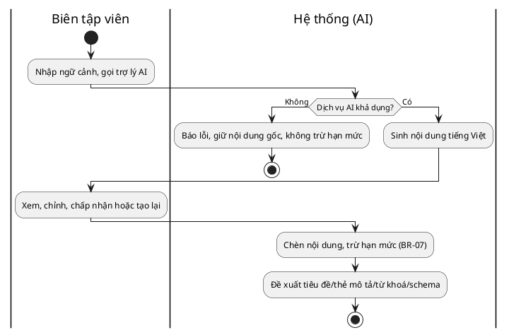

#### 1.4.3 Quy tắc xử lý nghiệp vụ
| Bước | Người thực hiện / HT | BR Code | Mô tả |
|:---:|:---:|:---:|---|
| 4 | Hệ thống | BR-07 | Mỗi lần sử dụng trí tuệ nhân tạo thành công trừ vào hạn mức của khách hàng. |

#### 1.4.4 Thiết kế giao diện
| STT | Trường thông tin | Định dạng dữ liệu | Mô tả | Bắt buộc |
|---|---|---|---|---|
| 1 | Ô nhập ngữ cảnh | Text nhiều dòng | Yêu cầu/ngữ cảnh nội dung | x |
| 2 | Kết quả gợi ý | Khung xem trước | Nội dung do trí tuệ nhân tạo sinh | Hệ thống |
| 3 | Hạn mức còn lại | Số | Hạn mức trí tuệ nhân tạo của khách thuê | Hệ thống |

### 1.5 Tạo trang web từ giao diện mẫu hoặc trí tuệ nhân tạo

#### 1.5.1 Mô tả chung
| Trường | Nội dung |
|---|---|
| ID | UC-05 |
| Tên | Tạo trang web từ giao diện mẫu hoặc trí tuệ nhân tạo |
| Mô tả | Khởi tạo nhanh trang web từ mẫu theo ngành hoặc từ mô tả |
| Tác nhân | Quản trị viên, Biên tập viên |
| Ưu tiên | Trung bình |
| Trigger | Chọn "Tạo trang web mới" |
| Tiền điều kiện | Gói cho phép thêm trang web; trong hạn mức |
| Kết quả (hậu điều kiện) | Trang web mới với cấu trúc cơ bản, sẵn sàng chỉnh sửa |
| **Luồng chính** | 1. Người dùng chọn mẫu theo ngành hoặc nhập mô tả doanh nghiệp. 2. Trí tuệ nhân tạo sinh trang web nháp từ mô tả. 3. Hệ thống tạo trang web và các trang mẫu. 4. Người dùng vào trình soạn thảo tinh chỉnh. |
| **Luồng phụ** | 1a. Chỉ dùng mẫu, không dùng trí tuệ nhân tạo. |
| **Luồng ngoại lệ / kết thúc** | 1a-x. Vượt hạn mức số trang web của gói → mời nâng cấp. |

#### 1.5.2 Luồng xử lý
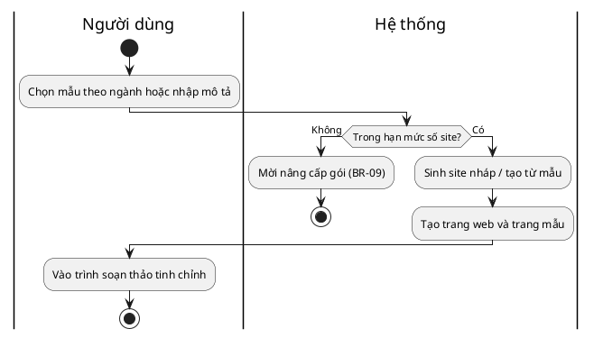

#### 1.5.3 Quy tắc xử lý nghiệp vụ
| Bước | Người thực hiện / HT | BR Code | Mô tả |
|:---:|:---:|:---:|---|
| 1 | Hệ thống | BR-09 | Không vượt số trang web của gói; vượt thì chặn và mời nâng cấp. |

#### 1.5.4 Thiết kế giao diện
| STT | Trường thông tin | Định dạng dữ liệu | Mô tả | Bắt buộc |
|---|---|---|---|---|
| 1 | Chọn ngành/mẫu | Danh sách chọn | Mẫu bản địa theo ngành | x |
| 2 | Mô tả doanh nghiệp | Text nhiều dòng | Dùng cho trí tuệ nhân tạo sinh site | Không |

### 1.6 Quản lý người dùng và phân quyền

#### 1.6.1 Mô tả chung
| Trường | Nội dung |
|---|---|
| ID | UC-06 |
| Tên | Quản lý người dùng và phân quyền |
| Mô tả | Quản trị viên mời người dùng và gán vai trò |
| Tác nhân | Quản trị viên |
| Ưu tiên | Cao |
| Trigger | Quản trị viên mời hoặc sửa người dùng |
| Tiền điều kiện | Quản trị viên đã đăng nhập |
| Kết quả (hậu điều kiện) | Người dùng được tạo/cập nhật với vai trò tương ứng |
| **Luồng chính** | 1. Quản trị viên mời người dùng qua thư điện tử, chọn vai trò. 2. Hệ thống gửi lời mời, tạo người dùng trạng thái chờ kích hoạt. 3. Người được mời đặt mật khẩu, kích hoạt. 4. Hệ thống áp ma trận phân quyền theo vai trò. |
| **Luồng phụ** | 1a. Sửa vai trò người dùng hiện có. |
| **Luồng ngoại lệ / kết thúc** | 1a. Thư điện tử đã tồn tại → báo lỗi. 2a. Vượt số chỗ ngồi của gói → mời nâng cấp. |

#### 1.6.2 Luồng xử lý
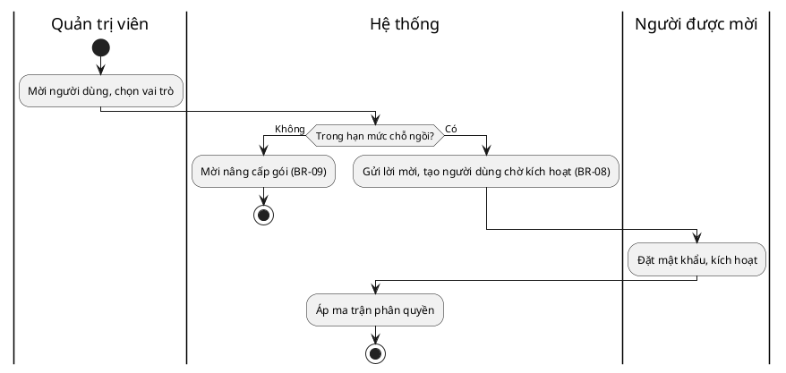

#### 1.6.3 Quy tắc xử lý nghiệp vụ
| Bước | Người thực hiện / HT | BR Code | Mô tả |
|:---:|:---:|:---:|---|
| 2 | Hệ thống | BR-08 | Người dùng được mời ở trạng thái chờ kích hoạt cho đến khi đặt mật khẩu. |
| 2 | Hệ thống | BR-09 | Không vượt số chỗ ngồi của gói; vượt thì chặn và mời nâng cấp. |

#### 1.6.4 Thiết kế giao diện
| STT | Trường thông tin | Định dạng dữ liệu | Mô tả | Bắt buộc |
|---|---|---|---|---|
| 1 | Thư điện tử | Email | Địa chỉ người được mời | x |
| 2 | Vai trò | Danh sách chọn | Quản trị/Biên tập/Trưởng phòng/Cộng tác | x |
| 3 | Trạng thái | Nhãn | Chờ kích hoạt/Đang hoạt động | Hệ thống |

### 1.7 Quản lý gói đăng ký và thanh toán định kỳ

#### 1.7.1 Mô tả chung
| Trường | Nội dung |
|---|---|
| ID | UC-07 |
| Tên | Quản lý gói đăng ký và thanh toán định kỳ |
| Mô tả | Chọn gói và thanh toán qua cổng nội địa; áp hạn mức theo gói |
| Tác nhân | Quản trị viên; Hệ thống (tính phí) |
| Ưu tiên | Cao |
| Trigger | Quản trị viên chọn/đổi gói hoặc đến kỳ gia hạn |
| Tiền điều kiện | Có phương thức thanh toán hợp lệ |
| Kết quả (hậu điều kiện) | Gói cập nhật, hoá đơn phát hành, quyền tính năng áp dụng |
| **Luồng chính** | 1. Quản trị viên chọn gói. 2. Chọn phương thức thanh toán nội địa. 3. Hệ thống xử lý thanh toán qua cổng nội địa. 4. Hệ thống kích hoạt gói, phát hành hoá đơn, áp hạn mức. |
| **Luồng phụ** | 1a. Gói miễn phí → bỏ qua thanh toán, áp hạn mức miễn phí. Gia hạn → thu phí đúng mức cam kết. |
| **Luồng ngoại lệ / kết thúc** | 3a. Thanh toán thất bại → giữ gói cũ, cho thử lại; sau N lần hạ về gói miễn phí. |

#### 1.7.2 Luồng xử lý
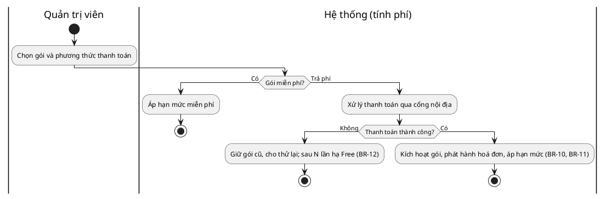

#### 1.7.3 Quy tắc xử lý nghiệp vụ
| Bước | Người thực hiện / HT | BR Code | Mô tả |
|:---:|:---:|:---:|---|
| 4 | Hệ thống | BR-10 | Quyền và hạn mức tính năng áp theo gói đang hiệu lực. |
| 4 | Hệ thống | BR-11 | Giá khi gia hạn không vượt mức đã cam kết. |
| 3a | Hệ thống | BR-12 | Sau một số lần thanh toán thất bại, hạ về gói miễn phí. |

#### 1.7.4 Thiết kế giao diện
| STT | Trường thông tin | Định dạng dữ liệu | Mô tả | Bắt buộc |
|---|---|---|---|---|
| 1 | Danh sách gói | Bảng | Gói và giá theo đồng Việt Nam | Hệ thống |
| 2 | Phương thức thanh toán | Danh sách chọn | VNPay/MoMo/ZaloPay | x |
| 3 | Lịch sử hoá đơn | Bảng | Hoá đơn đã phát hành | Hệ thống |

### 1.8 Khách truy cập gửi biểu mẫu thu khách tiềm năng

#### 1.8.1 Mô tả chung
| Trường | Nội dung |
|---|---|
| ID | UC-08 |
| Tên | Khách truy cập gửi biểu mẫu thu khách tiềm năng |
| Mô tả | Khách điền và gửi biểu mẫu trên trang công khai |
| Tác nhân | Khách truy cập |
| Ưu tiên | Cao |
| Trigger | Khách gửi biểu mẫu |
| Tiền điều kiện | Trang có biểu mẫu đã xuất bản |
| Kết quả (hậu điều kiện) | Khách tiềm năng được lưu, chủ trang web được thông báo |
| **Luồng chính** | 1. Khách điền các trường biểu mẫu. 2. Hệ thống xác thực trường bắt buộc và mã xác minh. 3. Hệ thống lưu khách tiềm năng, gửi thông báo, tuỳ chọn đẩy sang quản lý khách hàng. 4. Hiển thị thông báo cảm ơn. |
| **Luồng phụ** | 3a. Đẩy dữ liệu sang công cụ phân tích/quản lý khách hàng. |
| **Luồng ngoại lệ / kết thúc** | 2a. Thiếu trường bắt buộc/sai định dạng → báo lỗi từng trường. 2b. Nghi thư rác (mã xác minh sai) → từ chối. |

#### 1.8.2 Luồng xử lý
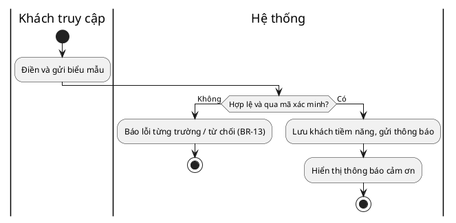

#### 1.8.3 Quy tắc xử lý nghiệp vụ
| Bước | Người thực hiện / HT | BR Code | Mô tả |
|:---:|:---:|:---:|---|
| 2 | Hệ thống | BR-13 | Biểu mẫu công khai phải qua xác thực trường bắt buộc và mã xác minh. |
| 3 | Hệ thống | — | Lưu trữ dữ liệu khách tiềm năng tuân thủ Nghị định 13/2023/NĐ-CP. |

#### 1.8.4 Thiết kế giao diện
| STT | Trường thông tin | Định dạng dữ liệu | Mô tả | Bắt buộc |
|---|---|---|---|---|
| 1 | Họ tên | Text | Tên khách | x |
| 2 | Thư điện tử / Số điện thoại | Email / Số | Thông tin liên hệ | x |
| 3 | Nội dung | Text nhiều dòng | Nhu cầu của khách | Không |
| 4 | Mã xác minh | Captcha | Chống thư rác | x |

### 1.9 Xem bảng điều khiển phân tích

#### 1.9.1 Mô tả chung
| Trường | Nội dung |
|---|---|
| ID | UC-09 |
| Tên | Xem bảng điều khiển phân tích |
| Mô tả | Hiển thị lưu lượng, công cụ tìm kiếm, chuyển đổi theo thời gian |
| Tác nhân | Trưởng phòng tiếp thị, Chuyên viên SEO |
| Ưu tiên | Trung bình |
| Trigger | Mở mục "Phân tích" |
| Tiền điều kiện | Trang web đã xuất bản, có dữ liệu |
| Kết quả (hậu điều kiện) | Hiển thị biểu đồ và chỉ số theo khoảng thời gian |
| **Luồng chính** | 1. Người dùng chọn trang web và khoảng thời gian. 2. Hệ thống tổng hợp sự kiện đo lường và hiển thị biểu đồ. 3. Người dùng lọc hoặc xuất báo cáo. |
| **Luồng phụ** | 3a. Xuất báo cáo ra tệp. |
| **Luồng ngoại lệ / kết thúc** | 2a. Chưa đủ dữ liệu → hiển thị trạng thái trống kèm hướng dẫn. |

#### 1.9.2 Luồng xử lý
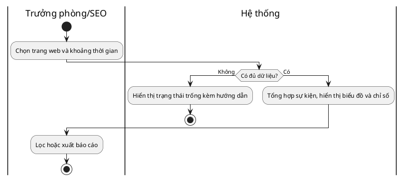

#### 1.9.3 Quy tắc xử lý nghiệp vụ
| Bước | Người thực hiện / HT | BR Code | Mô tả |
|:---:|:---:|:---:|---|
| 2 | Hệ thống | — | Dữ liệu phân tích cô lập theo khách thuê. |

#### 1.9.4 Thiết kế giao diện
| STT | Trường thông tin | Định dạng dữ liệu | Mô tả | Bắt buộc |
|---|---|---|---|---|
| 1 | Khoảng thời gian | Ngày–đến–ngày | Lọc theo thời gian | x |
| 2 | Biểu đồ chỉ số | Biểu đồ | Lưu lượng, công cụ tìm kiếm, chuyển đổi | Hệ thống |
| 3 | Nút xuất báo cáo | Nút | Xuất ra tệp | Không |

### 1.10 Đa ngôn ngữ, giao diện lập trình và nhãn trắng (mở rộng)

#### 1.10.1 Mô tả chung
| Trường | Nội dung |
|---|---|
| ID | UC-10 |
| Tên | Đa ngôn ngữ, giao diện lập trình và nhãn trắng |
| Mô tả | Nhóm chức năng mở rộng ngoài Sản phẩm Khả dụng Tối thiểu |
| Tác nhân | Biên tập viên; Quản trị viên; Lập trình viên |
| Ưu tiên | Thấp / Tương lai |
| Trigger | Bật đa ngôn ngữ / tạo khoá truy cập / bật nhãn trắng |
| Tiền điều kiện | Gói hỗ trợ tính năng tương ứng |
| Kết quả (hậu điều kiện) | Phiên bản ngôn ngữ với hreflang / khoá truy cập / cấu hình nhãn trắng |
| **Luồng chính** | 1. (Đa ngôn ngữ) Bật ngôn ngữ thứ hai, tạo phiên bản dịch, hệ thống áp hreflang. 2. (Giao diện lập trình) Tạo khoá truy cập, hệ thống cấp quyền đọc nội dung theo phạm vi. |
| **Luồng phụ** | 2a. (Nhãn trắng) Cấu hình thương hiệu và tính phí riêng cho đại lý. |
| **Luồng ngoại lệ / kết thúc** | 1a. Gói không hỗ trợ → mời nâng cấp. |

#### 1.10.2 Luồng xử lý
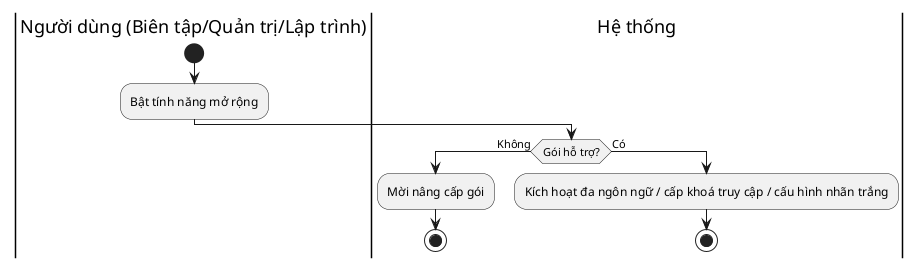

#### 1.10.3 Quy tắc xử lý nghiệp vụ
| Bước | Người thực hiện / HT | BR Code | Mô tả |
|:---:|:---:|:---:|---|
| 1 | Hệ thống | BR-10 | Tính năng mở rộng áp theo gói đang hiệu lực. |

#### 1.10.4 Thiết kế giao diện
| STT | Trường thông tin | Định dạng dữ liệu | Mô tả | Bắt buộc |
|---|---|---|---|---|
| 1 | Ngôn ngữ | Danh sách chọn | Tiếng Việt / Tiếng Anh | x (đa ngôn ngữ) |
| 2 | Khoá truy cập | Chuỗi | Khoá giao diện lập trình theo phạm vi | x (API) |
| 3 | Cấu hình thương hiệu | Biểu mẫu | Logo, tên miền, màu cho nhãn trắng | x (nhãn trắng) |

## 2. Yêu cầu phi chức năng phần mềm
| Mục | Yêu cầu | Tiêu chí đo |
|---|---|---|
| 2.1 Hiệu năng | Tốc độ tải trang công khai và phản hồi trình soạn thảo | Trang xuất bản đạt Lighthouse ≥ 90 (di động, mặc định); thao tác lưu/đăng < 2 giây với 95% yêu cầu ở tải bình thường |
| 2.2 Bảo mật | Hệ thống được quản lý, cô lập dữ liệu, tuân thủ pháp luật | Vá lỗi/cập nhật do hệ thống; cô lập dữ liệu theo khách thuê; tuân thủ Nghị định 13/2023/NĐ-CP; có mã xác minh và kiểm soát phiên |
| 2.3 Sao lưu | Sao lưu nội dung và phiên bản | Lưu phiên bản mỗi lần sửa; khôi phục được phiên bản trước; sao lưu định kỳ |
| 2.4 Tính ổn định | Độ sẵn sàng dịch vụ | Uptime ≥ 99,5%/năm; kiến trúc đa khách thuê chịu tải nhiều khách hàng |
| 2.5 Tính sử dụng | Dễ dùng cho người không chuyên kỹ thuật | Người dùng mới tự xuất bản trang đầu < 30 phút; giao diện và hỗ trợ tiếng Việt đầy đủ |

## 3. Các yêu cầu khác
- **3.1 Quy định chung các thành phần hệ thống:** thống nhất bộ thành phần giao diện; định dạng ngày giờ theo Việt Nam; đơn vị tiền theo đồng Việt Nam.
- **3.2 Quy định về thông báo:** thông báo trong ứng dụng và qua thư điện tử cho các sự kiện gửi duyệt, phê duyệt, xuất bản và thanh toán; nội dung tiếng Việt rõ ràng, có hành động kế tiếp.
- **3.3 Quy định tìm kiếm thông tin:** tìm nội dung theo tiêu đề, trạng thái và danh mục trong phạm vi trang web hoặc khách thuê.

## 4. Yêu cầu tích hợp
| Hệ thống ngoài | Dữ liệu trao đổi | Giao thức / API | Ghi chú |
|---|---|---|---|
| Cổng thanh toán nội địa (VNPay/MoMo/ZaloPay) | Yêu cầu và kết quả thanh toán | API cổng thanh toán | Tối thiểu một cổng cho MVP (FR-INT-001) |
| Dịch vụ trí tuệ nhân tạo | Ngữ cảnh và nội dung sinh ra | API dịch vụ AI | Phụ thuộc hạn mức (FR-AI-001, FR-AI-002) |
| Zalo, Facebook, công cụ phân tích, quản lý khách hàng | Sự kiện, khách tiềm năng | API/Pixel/Webhook | Ưu tiên trung bình (FR-INT-002) |
| Hệ thống bên thứ ba của lập trình viên | Nội dung theo phạm vi | REST/GraphQL | Ưu tiên Tương lai (FR-INT-003) |

## 5. Chuyển đổi dữ liệu
Ở Sản phẩm Khả dụng Tối thiểu, hỗ trợ nhập thủ công hoặc tệp dạng bảng ở mức cơ bản. Di trú dữ liệu tự động từ WordPress hoặc Wix không áp dụng cho bản này (thuộc phần ngoài phạm vi của Tài liệu Yêu cầu Nghiệp vụ).

## 6. Phụ lục
- Tài liệu tham chiếu: use-cases.md, user-stories.md, modeling.md, traceability-matrix.csv (cùng dự án, định dạng riêng lẻ để tiện theo dõi).
- Câu hỏi mở còn treo (cần tìm hiểu khách hàng): mức sẵn sàng chi trả; yếu tố quyết định mua; Sản phẩm Khả dụng Tối thiểu có cần thanh toán nội địa ngay hay không; mâu thuẫn phạm vi rộng so với ràng buộc thời gian và ngân sách (xử lý bằng phương pháp MoSCoW).
