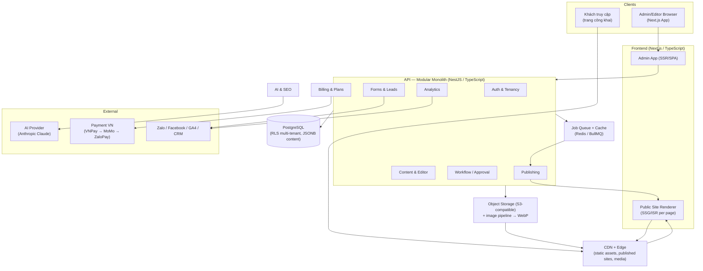
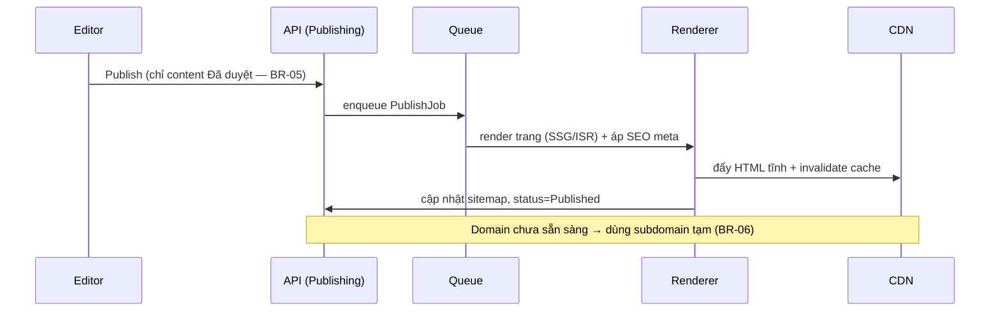
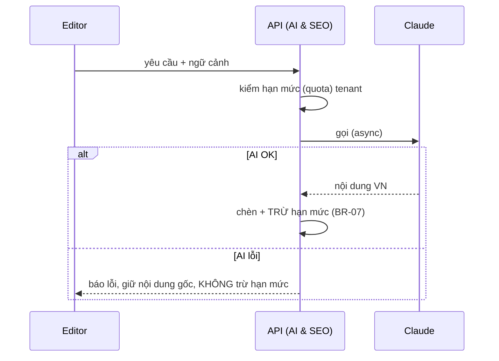

# System Architecture Overview — VietCMS

> Phase 3b · Technical Design · v1.0 · 2026-07-20
> Kiến trúc hệ thống cho VietCMS — no-code Marketing CMS SaaS **multi-tenant**. Nguồn yêu cầu: `docs/ba-docs/` (SRS, user-stories, modeling) + design handoff (`../uiux-design/06-testing-handoff/06-design-handoff-v1.md`).
> Đi kèm: [ADR log](02-adr-log-v1.md) · [Data model](03-data-model-v1.md).

---

## 1. Requirements Summary

### 1.1 Functional (nhóm chức năng — SRS §II)
1. Quản lý nội dung (no-code editor, trang/bài/danh mục, media, template/AI builder) — UC-01, UC-05
2. Duyệt & phân quyền (workflow, RBAC, đa site) — UC-02, UC-06
3. SEO & AI (viết nội dung VN, AI SEO/AEO, thẻ SEO/sitemap, ảnh) — UC-04
4. Xuất bản & tên miền (1-click, lên lịch, custom domain) — UC-03
5. Tích hợp & phân tích (form/lead, kênh, dashboard) — UC-08, UC-09
6. Tài khoản, gói & thanh toán VN — UC-07

### 1.2 Non-Functional (SRS §III.2) — **định hướng kiến trúc**
| NFR | Yêu cầu | Hệ quả kiến trúc |
|---|---|---|
| **Hiệu năng** | Trang xuất bản Lighthouse **≥ 90 mobile**; lưu/đăng **< 2s p95** | Public site **static/ISR + CDN**; tách rendering khỏi admin |
| **Bảo mật** | Managed, **cô lập dữ liệu theo tenant**, ND 13/2023, captcha, kiểm soát phiên | **RLS + tenant_id** mọi bảng; defense-in-depth; PII lead tuân thủ |
| **Sao lưu** | Versioning mỗi lần sửa, khôi phục, backup định kỳ | `content_version` append-only; PITR của DB |
| **Ổn định** | **Uptime ≥ 99,5%/năm**; chịu tải multi-tenant | Managed services, stateless app, queue tách tải |
| **Dễ dùng** | Người mới tự xuất bản < 30 phút; tiếng Việt đầy đủ | UX đã thiết kế (Phase 3a); onboarding |

### 1.3 Constraints
- **Thời gian:** MVP ~6 tháng · **Ngân sách:** hạn chế → ưu tiên **managed services**, không tự xây hạ tầng.
- **Kỹ thuật:** multi-tenant; SEO/hiệu năng mặc định.
- **Pháp lý:** Nghị định 13/2023/NĐ-CP (bảo vệ dữ liệu cá nhân).
- **Bản địa:** tiếng Việt; thanh toán VNPay/MoMo/ZaloPay.
- **MoSCoW:** MVP = US-01, 05, 06, 07, 09, 14, 19 (Must). Headless API, white-label, đa ngôn ngữ = sau.

---

## 2. High-Level Architecture

### 2.1 Thành phần chính
| Thành phần | Trách nhiệm | Công nghệ |
|---|---|---|
| **Admin App** | Editor, duyệt, dashboard, cấu hình | Next.js (App Router) + React + TS + design system |
| **Public Site Renderer** | Kết xuất trang công khai đa tenant, tối ưu SEO/tốc độ | Next.js ISR/SSG + CDN, custom domain |
| **API (Modular Monolith)** | Nghiệp vụ, RBAC, orchestration | NestJS (TypeScript), REST (headless GraphQL sau) |
| **PostgreSQL** | Nguồn sự thật; multi-tenant qua RLS; block content JSONB | Managed Postgres (Neon/Supabase/RDS) |
| **Redis + BullMQ** | Job queue (publish/AI/image), cache, rate-limit | Managed Redis |
| **Object Storage + CDN** | Media, output tĩnh; ảnh → WebP | S3/R2 + Cloudflare/CloudFront |
| **AI Provider** | Sinh nội dung VN, gợi ý SEO/AEO | Anthropic Claude (qua abstraction) |
| **Payment** | Thanh toán định kỳ VN | VNPay (MVP) → MoMo/ZaloPay |

> **Vì sao Modular Monolith:** đội nhỏ + 6 tháng + ngân sách hạn → một deployable đơn giản, module hoá rõ ràng (dễ tách microservice sau nếu cần). Chi tiết: [ADR-001](02-adr-log-v1.md#adr-001).

---

## 3. Multi-Tenancy (cốt lõi)

**Mô hình:** *Shared database, shared schema* — mọi bảng có `tenant_id`, cô lập bằng **PostgreSQL Row-Level Security (RLS)**. Rẻ, đơn giản vận hành, đủ cho mid-market. Chi tiết + đánh đổi: [ADR-002](02-adr-log-v1.md#adr-002).

- Mỗi request set `SET app.current_tenant = :tenant_id` → RLS policy lọc tự động.
- **Defense-in-depth:** tenant scope ở (1) API guard, (2) query layer, (3) RLS DB. Không dựa vào một tầng.
- Cách ly được kiểm bằng test tự động (cross-tenant access phải fail).

---

## 4. Key Flows

### 4.1 Xuất bản (UC-03, BR-05/06) — đạt Lighthouse ≥ 90

### 4.2 Trợ lý AI (UC-04, BR-07)

### 4.3 Duyệt (UC-02, BR-03/04/05)
Submit → nếu chưa cấu hình Approver ⇒ chặn + cảnh báo (BR-04) → thông báo Approver (SSE + email, BR-03) → Approve/Reject kèm ghi chú → lưu `APPROVAL` (ai, khi nào) → chỉ *Đã duyệt* mới publish được (BR-05).

---

## 5. Tech Stack Recommendation

| Lớp | Lựa chọn | Lý do | Thay thế đã cân nhắc |
|---|---|---|---|
| Frontend | **Next.js + React + TypeScript** | SSR/ISR đạt SEO/Lighthouse (MT-04); hệ sinh thái lớn | Nuxt, Remix |
| Backend | **NestJS (TypeScript)** | Cùng ngôn ngữ FE→ share type, cấu trúc module rõ, DI | FastAPI (Python — mạnh AI), Spring Boot (nặng hơn) |
| DB | **PostgreSQL** (managed) | Quan hệ + JSONB (block), RLS multi-tenant, full-text | MongoDB (yếu ACID), MySQL (RLS yếu) |
| Queue/Cache | **Redis + BullMQ** | Job async (publish/AI/ảnh), cache, rate-limit | Postgres-based queue, RabbitMQ |
| Storage/CDN | **S3-compatible + CDN** | Media + output tĩnh; WebP; tốc độ toàn cầu | — |
| Realtime | **SSE** (thông báo duyệt) | Một chiều, đơn giản hơn WebSocket | WebSocket (khi cần 2 chiều) |
| AI | **Anthropic Claude** (abstraction) | Tiếng Việt tốt, chất lượng cao | OpenAI/Gemini (qua cùng abstraction) |
| Payment | **VNPay** (MVP) → MoMo/ZaloPay | Abstraction, thêm cổng sau | — |
| Chart | **Recharts** | React/TS, đủ cho dashboard | Chart.js |
| Search | **Postgres full-text** (MVP) | Tìm theo tiêu đề/trạng thái/danh mục trong scope | Elastic/Meilisearch (sau) |
| Observability | Structured logging + **Sentry** + uptime/metrics | Đạt NFR ổn định 99.5% | — |
| Infra | Docker + PaaS/managed K8s | Ngân sách hạn → managed để giảm ops | Self-managed K8s (sau) |

> Tech stack quyết định ở [ADR-003](02-adr-log-v1.md#adr-003) (DB), [ADR-004](02-adr-log-v1.md#adr-004) (rendering), [ADR-009](02-adr-log-v1.md#adr-009) (backend).

---

## 6. RBAC (giải Open Q5)

| Vai trò | Phạm vi | Quyền chính |
|---|---|---|
| **Quản trị viên (Admin)** | Tenant | Toàn quyền: người dùng, gói, thanh toán, site, publish |
| **Trưởng phòng (Manager)** | Nội dung, báo cáo | Duyệt/từ chối, xem dashboard |
| **Biên tập viên (Editor)** | Nội dung | Tạo/sửa/gửi duyệt/xuất bản |
| **Cộng tác viên (Contributor)** | Nội dung | Tạo/sửa; **không** xuất bản |
| **Khách truy cập (Viewer)** | Trang công khai | Xem, gửi form |

Thực thi 2 tầng: **API guard** (kiểm quyền theo action) + **RLS** (cô lập tenant). Permission lưu JSON trong `ROLE`.

---

## 7. Compliance — ND 13/2023/NĐ-CP
- Dữ liệu lead (PII) cô lập theo tenant; có cơ chế **đồng ý (consent)**, truy xuất/xoá theo yêu cầu, thời hạn lưu trữ.
- Mã hoá at-rest (DB/storage) + in-transit (TLS). Nhật ký truy cập dữ liệu cá nhân.
- Captcha + kiểm soát phiên (session) cho form công khai (BR-13).

---

## 8. Risks & Mitigations

| # | Rủi ro | Mức | Giảm thiểu |
|---|---|---|---|
| R1 | Public site không đạt Lighthouse ≥90 ở quy mô multi-tenant | Cao | Static/ISR + CDN; ngân sách render/trang; tách renderer khỏi admin |
| R2 | Rò rỉ dữ liệu chéo tenant | Cao | RLS + tenant_id mọi bảng + guard + **test cách ly bắt buộc** |
| R3 | Chi phí/độ trễ/hạn mức AI | TB | Async, cache, quota metering, abstraction, graceful failure (BR-07) |
| R4 | Tự động SSL cho custom domain | TB | ACME/managed certs; fallback subdomain tạm (BR-06) |
| R5 | Độ tin cậy cổng thanh toán VN | TB | Webhook **idempotent**, retry, dunning hạ Free sau N lần (BR-12) |
| R6 | Scope rộng vs 6 tháng | Cao | Modular monolith, Must-first (MoSCoW), managed services |
| R7 | Độ phức tạp editor no-code | Cao | Dùng lib có sẵn (TipTap/Lexical) + JSON block schema (ADR-005) |
| R8 | Vendor lock-in (AI/payment/storage) | TB | Abstraction layer cho từng nhóm |
| R9 | Đội nhỏ, nhiều tích hợp | TB | Ưu tiên Must; tích hợp Should/Could để sau; dùng SDK sẵn |

---

## 9. Open Questions — resolution (từ design handoff)
| # | Câu hỏi | Quyết định |
|---|---|---|
| 1 | Block model editor | JSON block schema lưu JSONB; editor trên **TipTap (ProseMirror)** — [ADR-005](02-adr-log-v1.md#adr-005) |
| 2 | Realtime duyệt | **SSE** cho thông báo; jobs qua Redis/BullMQ — [ADR-006](02-adr-log-v1.md#adr-006) |
| 3 | Nhà cung cấp AI + quota | **Claude** qua abstraction; `ai_usage` metering — [ADR-007](02-adr-log-v1.md#adr-007) |
| 4 | Chart library | **Recharts** |
| 5 | Ma trận quyền | Định nghĩa §6; guard + RLS |
| 6 | Cổng thanh toán ưu tiên | **VNPay** trước → MoMo → ZaloPay — [ADR-008](02-adr-log-v1.md#adr-008) |
| 7 | Versioning nội dung | `content_version` append-only mỗi save; giữ toàn bộ MVP, retention sau |

---

## 10. Roadmap kỹ thuật (gợi ý theo MoSCoW)
1. **Nền tảng:** Auth + Tenancy (RLS) + RBAC + skeleton modular monolith + CI/CD.
2. **Must:** Content/editor (US-01) → Workflow duyệt (US-05/06) → Publishing + domain (US-14) → Billing VNPay (US-19) → SEO meta/sitemap (US-09) → Analytics cơ bản (US-18).
3. **Should:** Media/WebP (US-02), AI nội dung (US-10), AI SEO (US-11), lịch xuất bản (US-15), form/lead (US-16), dashboard đầy đủ (US-18).
4. **Could/Sau:** đa site (US-08), AEO (US-12), AI ảnh (US-13), tích hợp kênh (US-17), đa ngôn ngữ (US-21).
5. **Won't (bản sau):** headless API (US-22), white-label (US-23).

---

*Next: review với stakeholder → nếu duyệt, sang Implementation (`nextjs-developer` + `nestjs-expert`). Data model chi tiết: [03-data-model-v1.md](03-data-model-v1.md).*
